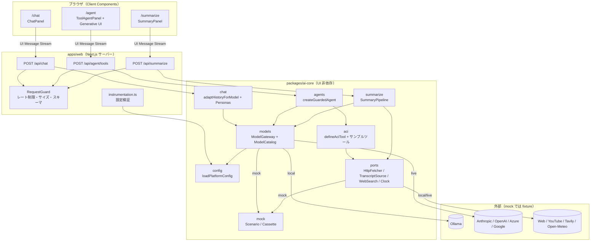
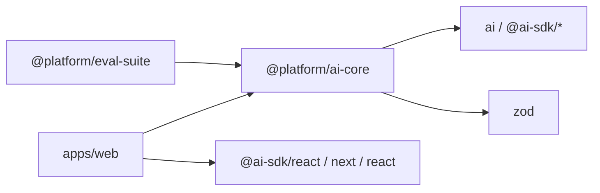
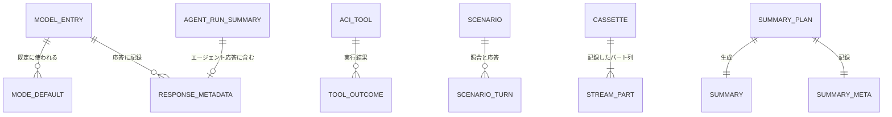

# agentic-ai-platform — Technical Plan

要件（WHAT）をアーキテクチャ（HOW）に落とし込む。実装コードは含まない。調査の根拠は [research.md](research.md) を参照。

## Summary

pnpm workspaces + Turborepo のモノレポを、mise のタスク（入口は `mise run gate`）で操作する。LLM を呼ぶロジックはすべて UI 非依存の `packages/ai-core` に置き、`apps/web`（Next.js App Router）は検査・配信・描画だけを担う。`ai-core` の中心は3つの共通基盤である。(1) **モデルゲートウェイ**: モデルカタログと実行モード（`mock` / `local` / `live`）からモデルを解決する。(2) **ガード付きエージェント**: 停止条件3種と停止理由を必ず持つ `ToolLoopAgent` を生成する。(3) **ACI ツールラッパ**: リスク区分・タイムアウト・エラーのツール結果化を強制する。M1 の機能（ストリーミングチャット、ツール呼び出しと Generative UI、構造化要約）はこの基盤の上に作る。品質ゲートは `mock` モードで Docker もネットワークも使わずに完走し、各段で空振りの合格を防ぐ。

この構成を選んだ理由: 後続 spec（002〜004）が依存する契約（カタログ、実行モード、停止理由、ツール結果の形式、テストのタグ規約、解説の枠組み）を M1 の時点で型として固定できる。参照リポジトリ（`next-agentic-stack`、`vaz-agentic-ai-next`）で動作実績のあるパターンを再利用できる。調査の詳細と ADR は [research.md](research.md) にある。

**M1 で作らないもの**: RAG・ワークフロー・ドメインエージェント・ハーネス・Evals の実体、承認 UI、トレースのエクスポート、DB を使う機能。M1 は、これらを差し込む型と拡張点だけを用意する（[Components](#components) の各 "Does NOT own"）。

## Architecture Overview

**制御とデータの流れ**

1. 起動時: `apps/web/instrumentation.ts` が `loadPlatformConfig()` を呼び、必須の環境変数と機能の対応を検証する（Req 1.9）。不足があれば、変数名と機能名を列挙して起動を止める。
2. リクエスト時: Route Handler は `RequestGuard` を通す（本文サイズ → 厳格スキーマ → 件数・長さ → `live` のときだけレート制限）。そのうえで `ai-core` の関数を呼び、`createAgentUIStreamResponse` または `createUIMessageStreamResponse` で UI メッセージストリームを返す。`request.signal` は LLM 呼び出しとツールまで伝播する（Req 3.5、6.3）。
3. モデル解決: 機能は `gateway.resolve({ purpose, modelId })` だけを呼ぶ。ゲートウェイはカタログで機能への対応を検査し（Req 2.9）、実行モードに応じたモデル実装を返す。録画用のミドルウェアは、どのモードでも同じ位置に合成する。
4. テスト時: Vitest が起動されると実行モードは強制的に `mock` になる（Req 2.5）。setup ファイルが `fetch`・`node:net`・`node:dns` を遮断する（Req 2.11）。E2E は `page.route` で `/api/*` をモックする（Req 1.17）。

**ワークスペース境界**

- `@platform/ai-core` は React・Next.js に依存しない（Req 1.2）。公開 API は `package.json#exports` のサブパス（`./models`、`./agents`、`./aci`、`./chat`、`./summarize`、`./mock`、`./ports`、`./testing`、`./config`）に限る。
- `@platform/eval-suite` は M1 では足場だけとする（`capability/`、`regression/` の空ディレクトリ、共通の Vitest 設定、`local` 限定テストのヘルパ）。評価の実体は 004 で作る。
- `apps/web` のサーバー専用モジュールは `apps/web/lib/server/` に集め、`server-only` を import する。クライアントへ渡す型は Zod を含まない `@platform/ai-core/models` の型だけにする（Req 1.10）。

## Components

コンポーネントは「基盤（リポジトリ全体）」「ai-core」「apps/web」「検証」「解説」の5群に分ける。各コンポーネントの "Does NOT own" は tasks.md の `_Boundary:_` が参照する契約である。

### 基盤（リポジトリ全体）

#### C1 WorkspaceToolchain

- **Responsibility**: ワークスペース構成、版の固定、lint / format / typecheck / test を1コマンドにまとめる品質ゲートを提供する。
- **Public interface**: mise タスク `setup`、`gate`、`lint`、`lint:fix`、`typecheck`、`test`、`test:local`、`test:db`、`test:e2e`、`test:mutation`、`test:coverage`、`outdated`、`secret-scan`、`secret-scan:staged`、`audit`、`services:up`、`services:up:db`、`services:down`、`gate:repeat`、`docs:check`、`check:model-ids`、`check:repo-rules`。`gate` は `lint` → `check:model-ids` → `check:repo-rules` → `typecheck` → `test` → `docs:check` の順に実行し、1段でも失敗すれば非ゼロで終了する。
- **Owns**: `mise.toml`、ルートの `package.json`、`pnpm-workspace.yaml`（`minimumReleaseAge: 1440`、`allowBuilds`。各エントリの直前に許可理由のコメントを必ず書く（constitution 原則 7）。コメントのないエントリは `check:repo-rules` が失敗させる）、`turbo.json`、`biome.json`（ADR-3）、`tsconfig.base.json`、`vitest.config.ts`（`projects` の集約）、`.githooks/`、`scripts/gate/*`。
- **Does NOT own**: 各ワークスペースのソースとテストの中身、CI ワークフロー（C2）、Compose 定義（C3）。
- **Requirements**: 1.1, 1.3, 1.4, 1.5, 1.6, 1.11, 1.12, 1.15, 2.18, NFR（検証速度、決定性、オフライン動作、型安全性、サプライチェーン）

#### C2 CiPipeline

- **Responsibility**: プルリクエストで品質ゲート相当の検証、3エンジンの E2E、シークレットスキャン、依存監査、ミューテーションテストを実行し、結果をステータスとして報告する。
- **Public interface**: `.github/workflows/ci.yml` のジョブ `gate`、`e2e`（マトリクス: chromium / firefox / webkit）、`secret-scan`、`audit`、`mutation`、`client-bundle`、および必須ステータスの集約ジョブ `ci-status`（`needs` + `if: always()`）。
- **Owns**: `.github/workflows/ci.yml`、`.github/dependabot.yml`。Actions はコミット SHA で固定し、ワークフローの `permissions` は `contents: read` だけにする。依存のインストールは全ジョブで `mise run setup`（`pnpm install --frozen-lockfile`）を使う。SHA 固定、`permissions`、`--frozen-lockfile` の3点は `check:repo-rules`（C20）がワークフロー定義を走査して検査する。
- **Does NOT own**: 各検証の中身（mise タスクとスクリプトを呼ぶだけ）。
- **Requirements**: 1.7, 1.10, 1.18, NFR（サプライチェーン）

#### C3 LocalServices

- **Responsibility**: ハンズオン用の依存サービス（Postgres + pgvector、Langfuse 一式）をコンテナで起動する。
- **Public interface**: `compose.yaml` のプロファイル `db`（`postgres`: `pgvector/pgvector:pg17`）と `trace`（`langfuse-web`、`langfuse-worker`、`clickhouse`、`redis`、`minio`）。Langfuse のデータベースは `postgres` サービスに同居させる（ADR-12）。
- **Owns**: `compose.yaml`、`infra/postgres/init/*.sql`（`CREATE EXTENSION vector`、Langfuse 用データベースの作成）、`.env.example` の Compose 関連の項目。
- **Does NOT own**: DB スキーマとマイグレーション（002）、OTLP のエクスポート（004）。
- **Requirements**: 1.8

### packages/ai-core

#### C4 PlatformConfig（`ai-core/src/config/`）

- **Responsibility**: 環境変数を Zod で検証し、実行モード・プロバイダ・用途別モデル・上限値を型付きの設定として返す。
- **Public interface**:
  - `loadPlatformConfig(env?: EnvSource, options?: { features?: readonly FeatureId[] }): PlatformConfig`
  - `resolveRunMode(env: EnvSource): RunMode` — テストランナーの中（`VITEST` が定義されている）では `AI_TEST_RUN_MODE ?? "mock"`、それ以外では `AI_RUN_MODE ?? "local"`
  - `class ConfigError extends PlatformError { missing: readonly { variable: string; feature: FeatureId }[] }`
- **Owns**: 環境変数のスキーマ（`env-schema.ts`）、機能と必須変数の対応表（`feature-requirements.ts`）、上限値の既定値（`defaults.ts`: 停止条件、レート制限、入力サイズ）。
- **Does NOT own**: モデル ID の一覧（C5）、秘密情報の実体。`process.env` を直接読むのは既定引数の1か所だけで、他のモジュールは `EnvSource` を受け取る。
- **Requirements**: 1.9, 2.1, 2.5, 2.8, 2.12, NFR（秘密情報）

#### C5 ModelCatalog（`ai-core/src/models/catalog.ts`）

- **Responsibility**: モデル ID、プロバイダ、対応機能、コンテキスト上限、入出力トークン単価、実行モード・用途ごとの既定モデルを1か所で定義する。
- **Public interface**: `MODEL_CATALOG`（`as const satisfies ModelCatalog`）、`getModelEntry(id: ModelId): ModelEntry`、`listModels(filter: { mode: RunMode; provider?: ProviderId; capability?: Capability }): readonly ModelEntry[]`、`defaultModelFor(mode, provider, purpose): ModelId`、`estimateCost(usage, entry): CostEstimate | undefined`。型 `ProviderId`、`ModelId`、`Capability`、`ModelPurpose` は Zod を含まない（クライアントでも import できる）。
- **Owns**: カタログのデータ。モデル ID の文字列リテラルを書いてよいのは、このファイルと C4 の `env-schema.ts`（既定値）だけ（Req 2.18）。
- **Does NOT own**: モデル実装の生成（C6）、コストの表示（004）。
- **Requirements**: 2.2, 2.8, 2.10, 2.17, 2.18, NFR（コスト可視化の算出元）

#### C6 ModelGateway（`ai-core/src/models/gateway.ts`）

- **Responsibility**: 用途とモデル ID から、実行モードに応じた `LanguageModel` / `EmbeddingModel` を返す。返す前に、認証情報・接続・機能への対応を検査する。
- **Public interface**:
  - `createModelGateway(deps: GatewayDeps): ModelGateway`
  - `gateway.resolve(request: { purpose: ModelPurpose; modelId?: ModelId; require?: readonly Capability[] }): Promise<ResolvedModel>`（`ResolvedModel = { model: LanguageModel; entry: ModelEntry; mode: RunMode }`）
  - `gateway.resolveEmbedding(request): Promise<ResolvedEmbeddingModel>`
  - `gateway.availableModels(): readonly ModelOption[]`（認証情報が揃っているプロバイダのモデルだけを返す。Req 3.2 の一覧に使う）
  - エラー: `ProviderCredentialsMissingError`（2.6）、`OllamaUnavailableError`（2.7）、`CapabilityUnsupportedError`（2.9）
- **Owns**: プロバイダファクトリの対応表（`providers.ts`: anthropic / openai / azure / google / ollama）、Ollama の事前検査（`GET {baseUrl}/api/tags` で接続とモデルの取得済みを確認し、結果を短時間キャッシュする）、ミドルウェアの合成（録画時だけ `recordingMiddleware` を `wrapLanguageModel` で合成する）。
- **Does NOT own**: シナリオとカセットの中身（C7）、リクエスト単位のレート制限（C14）、テレメトリの登録（004）。
- **Requirements**: 2.1, 2.2, 2.3, 2.6, 2.7, 2.9, 2.10, 3.2

#### C7 MockRuntime（`ai-core/src/mock/`）

- **Responsibility**: `mock` モードで、ネットワークを使わずに決定論的な応答（テキスト、構造化オブジェクト、ツール呼び出し、ストリームチャンク）を返す。`local` / `live` の録画を扱う。
- **Public interface**:
  - `defineScenario(scenario: ScenarioDefinition): ScenarioDefinition`、`createScenarioModel(options: { scenarios: readonly ScenarioDefinition[]; cassettes?: CassetteStore }): LanguageModelV4`
  - `createCassetteStore(dir: string): CassetteStore`（`get(key)`、`put(key, cassette)`）
  - `recordingMiddleware(store: CassetteStore, redactor: Redactor): LanguageModelMiddleware`、`createRedactor(env: EnvSource): Redactor`
  - `requestKey(params: LanguageModelV4CallOptions, purpose: ModelPurpose): RequestKey`（正規化した JSON の SHA-256）
  - `createDeterministicEmbeddingModel(options: { dimensions: number }): EmbeddingModelV4`（テキストの SHA-256 をシードにした PRNG で生成し、L2 正規化したベクトル）
  - `class MockFixtureMissingError extends PlatformError { key: RequestKey; nearest: readonly string[] }`
  - 外部サービスの fixture: `createFixtureHttpFetcher(fixtures)`、`createFixtureTranscriptSource(fixtures)`、`createFixtureWebSearch(fixtures)`
- **解決規則**（ADR-5）:
  1. **シナリオは述語で照合する**。`ScenarioTurn.match` の条件（すべて AND）を、定義順に評価する。一致したターンが複数あればエラーにせず、定義順で最初のものを使う。述語が曖昧なシナリオを書いた場合に気づけるよう、`resolve.test.ts` で「同一要求に2つ以上のターンが一致する fixture」を検出する検査を行う。
  2. **カセットはキーで照合する**。シナリオが一致しなかったときだけ、`requestKey()` の値でカセットを探す。
  3. どちらにもなければ `MockFixtureMissingError`。ネットワークへはフォールバックしない。
- **照合に使う値の出どころ**: `LanguageModelV4CallOptions` には用途もステップ番号も含まれないため、次のように決める。
  - `purpose`: `gateway.resolve({ purpose })` がモックモデルを生成する時点で束縛する（`createScenarioModel({ ..., purpose })`）。1つのモックモデルは1つの用途に対応する。
  - `stepIndex`: プロンプト内で最後の user メッセージより後にある assistant メッセージの数から導く（最初の応答が 0）。エージェントの内部状態には依存しない。
  - `toolResultFor`: プロンプト末尾の tool メッセージのツール名。
  - `lastUserTextIncludes`: 最後の user メッセージのテキストパートを連結したもの。
- **Owns**: シナリオとカセットの形式（[Data Model](#data-model)）、`packages/ai-core/fixtures/`（M1 の機能のシナリオ・カセット・外部サービス fixture）。シナリオ fixture の中でモデル ID を書く必要がある場合は、文字列リテラルではなくカタログの定数を import する。カセット JSON の `request.modelId` は、`catalog.test.ts` がカタログに実在することを検証する（`check-model-ids` は JSON を走査しない）。
- **Does NOT own**: 後続 spec の fixture（RAG、E2B、arXiv、MCP 等。各 spec が同じ形式で追加する）。
- **Requirements**: 2.4, 2.13, 2.14, 2.15, 2.16

#### C8 GuardedAgent（`ai-core/src/agents/`）

- **Responsibility**: 3種の停止条件と停止理由を必ず持つ `ToolLoopAgent` を生成し、実行サマリを返す。
- **Public interface**:
  - `createGuardedAgent<TOOLS extends ToolSet>(options: GuardedAgentOptions<TOOLS>): GuardedAgent<TOOLS>`。`GuardedAgentOptions` は `model`、`instructions`、`tools`、`limits: LoopLimits`、`clock: Clock`、`signal: AbortSignal`（呼び出し元の中断。Route Handler では `request.signal`）、`observers?: readonly RunObserver[]` を持つ。
  - **1回の実行につき1回生成する**（ADR-6）。`GuardedAgent` は1回の実行（run）に束縛されたオブジェクトで、`agent: ToolLoopAgent<never, TOOLS>`（`createAgentUIStreamResponse` に渡す）、`abortSignal: AbortSignal`（下記の合成済みシグナル。`createAgentUIStreamResponse` の `abortSignal` に渡す）、`summary(): AgentRunSummary`（実行終了後に確定した値を返す。終了前の呼び出しは `PlatformError`）、`done: Promise<AgentRunSummary>` を持つ。生成時刻（`clock.now()`）を run の開始時刻とする。停止条件の成立記録、ステップの集計、開始時刻は、すべてこのオブジェクトの内部に閉じる。インスタンスをリクエスト間で使い回す API は提供しない。
  - 生成時の検証: `LoopLimits` は正の整数。`tools` のツール数が **20 を超える**場合は `ConfigError` で生成を拒否する（constitution 原則 2）。
  - 停止条件: `stepLimit(n)`（`isStepCount` のラッパ）、`tokenBudget(n)`（各ステップの `inputTokens + outputTokens` の合計）、`deadline(clock, ms)`（run 開始時刻からの経過）。どれが成立したかを run 内部の記録に残す。
  - **実行時間上限の強制**: `deadline` はステップの完了時にしか評価されないため、1回の LLM 呼び出しが応答しない場合に上限が効かない。これを補うため、`abortSignal = AbortSignal.any([options.signal, clock.timeoutSignal(limits.maxDurationMs)])` を合成し、LLM 呼び出しとツールへ渡す。タイムアウト側のシグナルが中断した場合は、学習者による停止（`aborted`）ではなく `timeout` として記録する（どちらのシグナルが先に中断したかを `AbortSignal.reason` で判定する）。
  - **サマリの確定経路**:
    1. `onStepEnd`: ステップ数、`usage` の累積、呼び出したツール名を run 内部に加算する。
    2. `onEnd`: 正常終了（`completed` または停止条件の成立）でサマリを確定する。
    3. `onError`（`createAgentUIStreamResponse` のストリームエラー）: `abortSignal.aborted` が true なら中断の理由（`aborted` / `timeout`）、そうでなければ `error` としてサマリを確定する。
    4. 確定は1回だけ行う（最初に確定した値を採用する）。確定した時点で `done` を解決し、`observers` の `onRunEnd` を呼ぶ。
    5. `messageMetadata` コールバックは、`part.type === "finish"` のときに `summary()` の値を `run` として付与する。`finish` は `onEnd` より後に送られるため、正常終了では確定済みの値が付く。中断・エラーでは `finish` が送られないことがあるため、UI は `run` がない場合に中断・エラーとして表示する（C16）。
  - `deriveStopReason(input: StopReasonInput): StopReason`（優先順位: `aborted` → `error` → 成立した停止条件（`timeout` / `token-budget` / `step-limit`）→ `completed`）
  - `interface RunObserver { onRunEnd(summary: AgentRunSummary): void }`（M1 は UI メタデータへの記録とテストで使う。トレース（004 Req 5）と評価レポート（004 Req 3.10）は、この observer を実装して接続する）
- **Owns**: `LoopLimits` の検証（正の整数）、ツール数の上限（20）、停止理由の導出、`AgentRunSummary` の型。`ToolLoopAgent` を生成してよいのは `agents/guarded-agent.ts` だけ（それ以外の `new ToolLoopAgent` は `check:repo-rules` が失敗させる）。
- **Does NOT own**: ツールの定義（C9）、承認ゲート（004）、コンテキスト圧縮（004）、スパンの出力（004）。
- **Requirements**: 5.1, 6.1, 6.2, 6.3, 6.5

#### C9 AciToolkit（`ai-core/src/aci/`）

- **Responsibility**: ツール定義の共通規約（リスク区分、タイムアウト、エラーのツール結果化、Clock の注入）と、M1 のサンプルツールを提供する。
- **Public interface**:
  - `defineAciTool<INPUT, OUTPUT>(definition: AciToolDefinition<INPUT, OUTPUT>): AciTool<INPUT, OUTPUT>`。`AciToolDefinition` は `name`、`description`、`inputSchema`、`risk: ToolRisk`（必須）、`timeoutMs?`、`execute(input, ctx: AciToolContext)` を持つ。`AciToolContext` は `abortSignal`、`clock`、`toolCallId` を持つ。ラッパは `AbortSignal.any([options.abortSignal, clock.timeoutSignal(timeoutMs)])` で中断を合成し、戻り値を `ToolOutcome<OUTPUT>` にする。
  - `buildToolSet(tools: readonly AciTool[], availability: ToolAvailability): { tools: ToolSet; disabled: readonly DisabledTool[] }`。`DisabledTool` は `name`、`reason`、`requiredEnv` を持つ（Req 5.4）。`risk` が `read-only` 以外のツールを渡された場合は `ConfigError` で拒否する（constitution 原則 6。承認ゲート（004 Req 4）が実装されるまでの規則で、004 がこの検査を「承認ゲートを通るツールに限り許可」へ置き換える）。
  - サンプルツール: `createCurrentTimeTool(clock)`、`createCalculatorTool()`（四則演算・べき乗・括弧を再帰下降で解析する。`eval` と新しい依存を使わない）、`createCurrencyConvertTool(rates: RateTable)`（同梱の固定レート表と基準日。外部 API を使わない）、`createWeatherTool(fetcher: HttpFetcher)`（Open-Meteo。API キー不要）、`createWebSearchTool(search: WebSearchProvider)`（Tavily。キーがあるときだけ登録する）。
- **Owns**: `ToolRisk`、`ToolOutcome`、`ToolFailure` の型。M1 のツールはすべて `risk: "read-only"`。
- **Does NOT own**: 書き込み・破壊的ツールと、その登録制限（003 Req 1.16、1.17）。MCP クライアント（003）。承認（004）。
- **Requirements**: 5.2, 5.3, 5.4, 5.6, 5.7, 5.8, 6.4

#### C10 Ports（`ai-core/src/ports/`）

- **Responsibility**: 時刻と外部サービスへのアクセスをインターフェースとして定義し、実装を差し替えられるようにする。
- **Public interface**: `interface Clock { now(): number; timeoutSignal(ms: number): AbortSignal }`（`systemClock`、`createFakeClock()`）。`interface HttpFetcher { fetch(url: string, init?: FetchInit): Promise<HttpResponse> }`、`interface TranscriptSource { fetchTranscript(videoId: string, signal?: AbortSignal): Promise<TranscriptResult> }`、`interface WebSearchProvider { search(query: string, signal?: AbortSignal): Promise<readonly SearchHit[]> }`。実装は `createNodeHttpFetcher()`、`createYoutubeiTranscriptSource()`、`createTavilySearch(apiKey)`。
- **Owns**: ポートの型と本番実装。録画用ラッパ `recordingHttpFetcher(store, redactor)`（Req 2.13 の外部サービス部分）。
- **Does NOT own**: `mock` 用の fixture 実装（C7）。後続 spec のポート（Rerank、E2B、arXiv、MCP は各 spec が同じ規約で追加する）。
- **Requirements**: 2.13, 2.15, 5.7

#### C11 ChatCore（`ai-core/src/chat/`）

- **Responsibility**: ペルソナのテンプレート、モデル切り替え時の履歴変換、応答メタデータの組み立てを提供する。
- **Public interface**:
  - `PERSONAS: readonly PersonaTemplate[]`（`id`、`version`（semver）、`title`、`render(vars): string`）、`getPersona(id): PersonaTemplate`
  - `adaptHistoryForModel(messages: readonly UIMessage[], target: ModelEntry): UIMessage[]`（ADR-7）
  - `buildResponseMetadata(input: { entry: ModelEntry; usage: LanguageModelUsage; run?: AgentRunSummary; toolsCalled?: readonly string[] }): ResponseMetadata`
  - `chatRequestSchema`、`agentRequestSchema`（`z.strictObject`。`messages`、`modelId`、`personaId`）
- **Owns**: `personas/*.ts`（汎用アシスタント、Python 講師、厳密なレビュアの3種から開始）、`ResponseMetadata` の型。
- **Does NOT own**: HTTP の検査（C14）、会話の永続化（Out of Scope）。
- **Requirements**: 3.3, 3.7, 3.10, 5.6

#### C12 SummaryPipeline（`ai-core/src/summarize/`）

- **Responsibility**: 記事 URL・YouTube URL・字幕テキストから本文を取得し、分割の要否を判断して、スキーマ検証済みの要約オブジェクトを逐次生成する。
- **Public interface**:
  - `summarySchema`（Zod: `title`、`keyPoints`（ちょうど3件）、`tags`、`actionItems`、`chapters?`（`heading`、`startSeconds`））
  - `loadSource(input: SummaryInput, deps: SourceDeps): Promise<LoadedSource>`（`SummaryInput = { kind: "article"; url } | { kind: "youtube"; url } | { kind: "transcript"; text }`）。エラー: `SourceFetchError`（`reason: "http-status" | "empty-body" | "network"`、`status?`）、`TranscriptUnavailableError`（`reason: "no-captions" | "private" | "fetch-failed"`）
  - `planSummary(source: LoadedSource, entry: ModelEntry): SummaryPlan`（`strategy: "whole" | "staged"`、`estimatedInputTokens`、`chunks`。ADR-9）
  - `streamSummary(plan: SummaryPlan, deps: SummaryDeps): AsyncIterable<SummaryEvent>`（`partial` / `restart` / `final` / `meta` のイベント。検証失敗時は最大2回まで再生成し、それでも失敗したら `SummaryValidationError`（検証エラーの一覧を含む））
  - **Req 4.3 と 4.5 の境界**: `partial` は描画のための暫定値（`DeepPartial
`）で、スキーマ検証を経ていない。「要約オブジェクト」として UI とライブラリ利用者へ返すのは、スキーマ検証を通過した `final` だけとする。UI は `final` を受け取るまでカードを「生成中」として表示し、`restart` を受け取ったら暫定表示を破棄する。ライブラリ利用者向けの `summarize()`（`streamSummary` を最後まで消費する関数）は `final` だけを返す。
  - `cachePolicyFor(entry: ModelEntry): CachePolicy`（`anthropic`: 長文パートに `providerOptions.anthropic.cacheControl`、`openai` / `azure` / `google`: 自動キャッシュのため記録のみ、`ollama` / `mock`: なし）
- **Owns**: 要約スキーマ、本文抽出（`@mozilla/readability` + `jsdom`）、YouTube URL の解析、トークン推定（`gpt-tokenizer`）、分割と統合のプロンプト。
- **Does NOT own**: UI 描画（C17）、Map-Reduce の汎用ワークフロー（002 Req 3）。
- **Requirements**: 4.1, 4.2, 4.3, 4.4, 4.6, 4.7, 4.8, 4.9, 4.10, 4.11, 4.12

### apps/web

#### C13 AppShell

- **Responsibility**: 日本語 UI のレイアウト、ナビゲーション（`/chat`、`/agent`、`/summarize`）、起動時の設定検証、shadcn/ui の基本部品を提供する。
- **Public interface**: `app/layout.tsx`（`<html lang="ja">`）、`app/page.tsx`（モジュール一覧と実行モードの表示）、`instrumentation.ts#register`（`loadPlatformConfig({ features })` を呼び、`ConfigError` を整形して出力する）、`components/ui/*`。
- **Owns**: `next.config.ts`（`reactCompiler: true`、`typedRoutes: true`）、Tailwind CSS の設定、`lib/server/platform.ts`（ゲートウェイ・ポート・Clock を組み立てる唯一の場所。`server-only` を import する）。
- **Does NOT own**: 各画面の機能ロジック。
- **Requirements**: 1.9, 1.10, 3.8, NFR（UI 言語、アクセシビリティ、対応ブラウザ）

#### C14 RequestGuard（`apps/web/lib/server/guard.ts`）

- **Responsibility**: LLM を呼ぶ前に、リクエストを安い順に検査して拒否する。
- **Public interface**: `guardRequest(request: Request, policy: GuardPolicy, deps: { limiter: RateLimiter; mode: RunMode }): Promise<GuardResult<T>>`。順序: 本文サイズ（413）→ `z.strictObject` のスキーマ（400）→ メッセージ件数・テキスト長・画像の件数とサイズ（400）→ `live` のときだけレート制限（429 + `Retry-After`）。`createRateLimiter({ limit, windowMs, clock })`（プロセス内の固定窓）。
- **Owns**: HTTP エラーレスポンスの形（`{ error: { code, message } }`）、既定の上限（本文 512 KiB、メッセージ 50 件、テキスト 8,000 文字、画像 4 枚・各 5 MiB、20 リクエスト/分）。
- **Does NOT own**: LLM 呼び出し単位の上限（C6）、分散レート制限（Out of Scope）。
- **Requirements**: 3.11

#### C15 ChatFeature（`/chat`、`POST /api/chat`）

- **Responsibility**: モデル・ペルソナを切り替えられるストリーミングチャットを提供する。
- **Public interface**: `POST /api/chat`（[Interfaces / Contracts](#interfaces--contracts)）。UI: `ChatPanel`（`useChat` + `DefaultChatTransport`）、`ModelSelector`、`PersonaSelector`、`ImageAttachButton`（モデルが `imageInput` に対応しているときだけ有効）、`ReasoningDisclosure`（`
` で折りたたむ）、`MessageMeta`（モデル名、入出力トークン数、キャッシュ読み出し量）、`ErrorBanner`（再送ボタン付き）、`StopButton`（`stop()`）。
- **Owns**: チャット画面の状態（`useChat` が管理し、永続化しない）。
- **Does NOT own**: 履歴変換とメタデータの組み立て（C11）、ツール（C16）。
- **Requirements**: 3.1, 3.2, 3.3, 3.4, 3.5, 3.6, 3.7, 3.8, 3.9, 3.10

#### C16 ToolAgentFeature（`/agent`、`POST /api/agent/tools`）

- **Responsibility**: `ToolLoopAgent` によるツール呼び出しの過程と結果を、型付きの UI 部品として表示する。
- **Public interface**: `POST /api/agent/tools`。UI: `ToolAgentPanel`、`ToolPartView`（`tool-<name>` パートの `state` ごとに表示を切り替える）、`TOOL_RENDERERS: Record<SampleToolName, ComponentType<ToolRendererProps>>`（`TimeCard`、`CalculationCard`、`CurrencyCard`、`WeatherCard`、`SearchResultsList`）、未登録ツール用の `RawJsonView`、`DisabledToolsNotice`（Req 5.4。表示する環境変数名はサーバーから届く `disabledTools[].requiredEnv` の値だけを使い、クライアントのコードに環境変数名を書かない。C20 のクライアントバンドル検査と両立させるため）、`RunSummaryBadge`（停止理由、ステップ数、累積トークン、経過時間、呼び出したツール。`run` のメタデータが届かずにストリームが終わった場合は「中断」または「エラー」と表示する。C8 のサマリの確定経路を参照）。
- **Owns**: ツール名と表示部品の対応表。
- **Does NOT own**: ツールの実装（C9）、停止条件（C8）、承認モーダル（004）。
- **Requirements**: 5.1, 5.4, 5.5, 5.6, 6.2, 6.3

#### C17 SummaryFeature（`/summarize`、`POST /api/summarize`）

- **Responsibility**: 入力（記事 URL / YouTube URL / 字幕テキスト）を受け取り、確定したフィールドから順にカードを描画する。
- **Public interface**: `POST /api/summarize`。UI: `SummaryForm`、`SummaryCard`（部分オブジェクトを描画する。未確定のフィールドはスケルトンで表示）、`ChapterList`（`MM:SS` 表示）、`SummaryMetaPanel`（戦略、推定・実測の入力トークン、キャッシュ読み出し量、再生成回数）、`SourceErrorView`。
- **Owns**: 要約画面の状態。
- **Does NOT own**: 取得・分割・生成・検証（C12）。
- **Requirements**: 4.5, 4.7, 4.8, 4.11, 4.12

### 検証

#### C18 TestHarness（`ai-core/src/testing/`、`tooling/vitest/`）

- **Responsibility**: テストの実行モードの固定、ネットワーク遮断、`local` 限定テストの分類、空振りの検出、モックのファクトリを提供する。
- **Public interface**:
  - `tooling/vitest/setup-hermetic.ts`: `globalThis.fetch`、`node:net` の `Socket.prototype.connect`、`node:dns` の `lookup` / `promises.lookup` / `resolve*` を、接続先を含む `NetworkBlockedError` で失敗させる。`AI_TEST_RUN_MODE=local` のときだけ、`OLLAMA_BASE_URL` のホストへの接続を許可する。
  - `tooling/vitest/global-setup-local.ts`: `AI_TEST_RUN_MODE=local` のときだけ Ollama の到達性と必要モデルを確認し、結果を `provide("localAvailability", ...)` で渡す。
  - `@platform/ai-core/testing`: `describeLocal(name, fn)`、`itLocal(name, fn)`（`localAvailability` が不可なら理由付きでスキップする）、`createTextStreamModel`、`createToolCallingModel`、`createObjectModel`（`MockLanguageModelV4` + `simulateReadableStream`）、`createFakeClock`。
  - `tooling/vitest/gate-reporter.ts`: 実行・成功・失敗・スキップ（理由別）の件数と、DB 依存で未実行の件数（`*.pg.test.ts` のファイル数）を表示する。実行件数が 0 なら終了コードを非ゼロにする。
  - `stryker.config.mjs`: 対象は制御ロジック（`agents/stop-conditions.ts`、`agents/stop-reason.ts`、`aci/define-tool.ts`、`config/run-mode.ts`、`mock/resolve.ts`、`summarize/plan.ts`、`summarize/retry.ts`）に限る。`typescript-checker` は使わない。閾値 `break: 70`。
- **Owns**: テストファイルの命名規約: `*.test.ts`（gate で実行）、`*.local.test.ts`（比較・品質評価。`local` のときだけ実行）、`*.db.test.ts`（インプロセス DB で gate に含める）、`*.pg.test.ts`（Docker の Postgres が必要。`mise run test:db` だけで実行）。
- **Does NOT own**: Evals の実体とグレーダー（004）。
- **Requirements**: 1.12, 1.13, 1.14, 1.15, 1.16, 2.5, 2.11, NFR（テストカバレッジ、決定性、オフライン動作）

#### C19 E2eSuite（`apps/web/e2e/`）

- **Responsibility**: 主要な画面操作を3エンジンで検証し、アクセシビリティとストリーミングの反映遅延を計測する。
- **Public interface**: `playwright.config.ts`（projects: chromium / firefox / webkit、`webServer` は `next start`、`AI_RUN_MODE=mock`）。`e2e/fixtures/*.sse`（UI メッセージストリームの fixture。手書きしない。`scripts/e2e/generate-sse-fixtures.mjs` が、`mock` モードの Route Handler を C7 のシナリオで実行した出力から生成する。Route Handler のテスト（`route.test.ts`）は、生成済みの fixture と現在の出力が一致することを検査し、ずれたら失敗する）、`e2e/support/mock-api.ts`（`page.route("/api/**")` で fixture を返す。遅延計測など、応答のタイミングを制御したい spec で使う）、`e2e/real-server.spec.ts`（`page.route` を使わず、`AI_RUN_MODE=mock` の `next start` の実際の Route Handler を通して、チャット・ツール・要約を1往復ずつ確認する。RequestGuard、ゲートウェイ、シナリオモデルを含む経路の結合確認）、`e2e/support/latency-probe.ts`（`page.addInitScript` でストリームのチャンク受信時刻を、`MutationObserver` で DOM への反映時刻を記録する）、`e2e/support/axe.ts`（`AxeBuilder.withTags(["wcag2a", "wcag2aa", "wcag21aa", "wcag22aa"])`）。スペック: `chat.spec.ts`、`agent-tools.spec.ts`、`summarize.spec.ts`、`keyboard.spec.ts`、`a11y.spec.ts`、`latency.spec.ts`。
- **Owns**: E2E の fixture と計測。Playwright の JSON 結果で「収集 0 件」「全件スキップ」を失敗とする検査（`scripts/gate/assert-playwright-nonempty.mjs`）。
- **Does NOT own**: 単体テスト（各コンポーネント）。
- **Requirements**: 1.17, 1.19, NFR（ストリーミング応答性、アクセシビリティ、対応ブラウザ）

#### C20 RepoChecks（`scripts/`）

- **Responsibility**: 設定では表現できないリポジトリ規約を、品質ゲートと CI で機械的に検査する。
- **Public interface**:
  - `scripts/check-model-ids.mjs`: モデル系列の接頭辞（`claude-`、`gpt-`、`gemini-`、`llama`、`qwen`、`gemma`、`granite`、`mistral` 等）を持つ文字列を検出する。走査ファイル数が 0 なら失敗。走査範囲と例外は次のとおり（constitution 原則 8。1.0.2 で解説の例外を廃止した）:
    - 走査対象: `apps/`、`packages/`、`scripts/`、`tooling/` の `*.ts`、`*.tsx`、`*.mjs` の文字列リテラルと、`docs/` と `README.md` の Markdown 本文。
    - 許可する場所: C5 の `catalog.ts`、C4 の `env-schema.ts`（既定値）、`check-model-ids` 自身とそのテスト。
    - 解説にも例外を設けない。Req 7.4 の差分表では、採用したモデルをカタログへの参照（例: `catalog: live.anthropic.chat`）で書く（2026-09-27 に、ドラフトの削除に伴い `model-id-allow` の囲みを廃止した）。
    - JSON（カセット等）は走査しない。代わりに `catalog.test.ts` がカセットの `modelId` をカタログと突き合わせる（C7）。
  - `scripts/check-repo-rules.mjs`: constitution の MUST 原則のうち、Biome の設定では表現できないリポジトリ規約を検査する。規則ごとに走査件数を出力し、どれかの規則で走査件数が 0 なら失敗させる。
    | 規則 | 検査内容 | 原則 |
    |---|---|---|
    | `no-deprecated-object-api` | `ai` から `generateObject` / `streamObject` を import していない | 1 |
    | `guarded-agent-only` | `new ToolLoopAgent` が `packages/ai-core/src/agents/guarded-agent.ts` 以外にない | 2 |
    | `ai-core-no-ui-deps` | `packages/ai-core/package.json` の依存と `src/` の import に `react`、`react-dom`、`next`、`@ai-sdk/react` がない | 5 |
    | `no-dynamic-eval` | `eval(`、`new Function(`、`node:child_process` / `child_process` の import が、許可リスト（M1 は空。003 がサンドボックスのアダプタを追加する）以外にない | 6 |
    | `tool-risk-declared` | `defineAciTool(` の呼び出しがすべて `risk:` を持つ（型でも強制するが、走査で二重に確認する） | 6 |
    | `actions-pinned` | `.github/workflows/*.yml` の `uses:` がすべて 40 桁のコミット SHA で固定され、各ジョブまたはワークフローに `permissions:` がある | 7 |
    | `frozen-lockfile` | ワークフロー内の依存インストールが `mise run setup` または `--frozen-lockfile` 付きである | 7 |
    | `allow-builds-reasoned` | `pnpm-workspace.yaml` の `allowBuilds` の各エントリの直前に理由のコメントがある | 7 |
    | `no-sensitive-logging` | `console.*` と `logger.*` の呼び出しに、`prompt`、`messages`、`input`（ツール引数）、`apiKey` を名前に含む識別子を渡していない（ロギング方針。[Error Handling](#error-handling--edge-cases) を参照） | 7 |
  - `scripts/check-client-bundle.mjs`（`next build` 後の `.next/static` を走査し、秘密情報の環境変数名と、CI で注入した番兵値が含まれていれば失敗。クライアントのコードに環境変数名を書かない規約（C16）と組み合わせる）、`scripts/check-updates.mjs`（先行版と `watsonx-ai-provider` の peerDependencies を npm レジストリで確認する）、`scripts/gate/count-*.mjs`（Biome と `tsc --listFilesOnly` の走査件数の検査）。
- **Owns**: 検査の規則と許可リスト。
- **Does NOT own**: lint のルール本体（Biome）。
- **Requirements**: 1.10, 1.15, 2.10, 2.18, Technical Constraints（`mise run outdated`）, constitution 原則 1、2、5、6、7

#### C21 EvalSuiteScaffold（`packages/eval-suite/`）

- **Responsibility**: 評価スイートのワークスペースを用意し、テスト方針（タグ規約、`local` 限定）の適用例を1件ずつ置く。
- **Public interface**: `package.json`、`vitest.config.ts`（ルートの `projects` に登録する）、`tests/capability/README.md`、`tests/regression/tool-agent-run.test.ts`（C8 の単体テストとは重ねず、M1 のツールエージェントを C7 のシナリオで最後まで走らせ、停止理由、呼び出したツールの列、最終回答の Outcome を回帰として検証する。`ai-core` の `stop-reason.test.ts` は純粋関数の網羅、こちらはエージェントの通し実行、と役割を分ける）、`tests/capability/summary-quality.local.test.ts`（`local` 限定の例。要約が3点の要点を持つことを実モデルで確認する）。
- **Owns**: 評価スイートのディレクトリ規約。
- **Does NOT own**: Capability / Regression 評価の本体、LLM-as-a-Judge（004 Req 3）。
- **Requirements**: 1.1, 1.13, 1.14

### 解説

#### C22 ModuleDocs（`docs/`）

- **Responsibility**: 19 モジュール共通の解説テンプレートと、Phase 1 の解説（1-0〜1-3）を日本語で提供し、その構造と参照を機械的に検査する。
- **Public interface**:
  - `docs/modules/_template.md`: 必須節（学習目標、主要トピック、ハンズオン手順（各手順に実行モードと外部サービスを記載）、習熟度判定チェックリスト、リファレンス実装とテストの所在、元教材との対照表（「移植で諦めたもの」列を含む）、移植時の変更点（Req 7.4。確定版の `specs/curriculum/changes-from-drafts.md` と実測に基づく）、Python / Streamlit 経験者向けコラム（Phase 1 のみ）、完成時点のタグ）。
  - `docs/modules/index.md`（19 モジュールの一覧と状態。M1 で作るのは 1-0〜1-3 の本文）、`docs/phases/phase-1.md`（IBM の3段階成熟度モデルのどの水準を扱うか）。
  - `docs/modules/1-0-intro.md`（7段階閉ループ、比較マトリクス、7段階とモジュールの対応表）、`1-1-dev-environment.md`（Langfuse の必要リソース、watsonx.ai をスキップした理由、TypeScript 先行版の方針と後退の記録を含む）、`1-2-ai-sdk-core-and-tools.md`（ToolLoopAgent と AgentExecutor の対比、停止条件の近似性の注意を含む）、`1-3-structured-output-and-summaries.md`（`mock` の埋め込みが検索精度の評価に使えないことを含む）。
  - `scripts/check-docs.mjs`: 必須節の存在、Req 7.9 の必須トピックの見出し、チェックリストの `<!-- test: path#name -->` 参照が実在するテストファイルとテスト名を指すことを検査する。走査した参照が 0 件なら失敗。テスト名は、`describe` / `it` / `test`（`describeLocal` / `itLocal` を含む）の第1引数の文字列リテラルから静的に抽出する。そのため、`it.each` やテンプレートリテラルで動的に名前を作るテストは参照先にできない。チェックリストから参照するテストは、名前を固定の文字列で書く（規約として `_template.md` と `docs/README.md` に記載する）。
  - 完成タグの規約: `module/1-1`、`module/1-2`、`module/1-3`（各モジュールの実装が完了した時点で付ける。1-0 は解説のみのためタグなし）。
- **Owns**: `docs/` 配下の全文書。
- **Does NOT own**: 2-1〜4-5 の本文（各 spec）。テストそのもの。
- **Requirements**: 1.8（必要リソースの記載）, 2.10（スキップの記載）, 2.16（精度の注意の記載）, 6.1（近似性の記載）, 7.1, 7.2, 7.3, 7.4, 7.5, 7.6, 7.7, 7.8, 7.9, 7.10, 7.11

## Data Model

M1 は永続化する DB を持たない。以下は、ワークスペース間と後続 spec の間で共有する型（`@platform/ai-core` の公開型）と、ファイルとして保存する fixture の形式である。すべての型は Zod スキーマまたは TypeScript の型で定義し、公開 API に `any` を含めない（NFR 型安全性）。

**モデルカタログ（C5）**

| Entity | Field | Type | Notes |
|--------|-------|------|-------|
| ModelEntry | id | `ModelId`（カタログのキーから導出したリテラル union） | プロバイダ上の実モデル ID。値は実装時に各社公式ドキュメントで確認する |
| | provider | `"anthropic" \| "openai" \| "azure" \| "google" \| "ollama" \| "mock"` | watsonx は v7 対応の実装が出るまで含めない（Req 2.10） |
| | modes | `readonly RunMode[]` | `mock` / `local` / `live` のどれで選べるか |
| | capabilities | `{ tools: boolean; structuredOutput: boolean; reasoning: boolean; imageInput: boolean; embedding: boolean; promptCache: "explicit" \| "automatic" \| "none" }` | Req 2.9、2.17、4.8 |
| | contextWindow | `number`（トークン） | Req 4.6、004 Req 1.1 |
| | maxOutputTokens | `number` | 分割判断の出力予約に使う |
| | pricing | `{ inputPerMTok: number; outputPerMTok: number; cacheReadPerMTok?: number; currency: "USD" } \| null` | `local` / `mock` は `null`。NFR コスト可視化 |
| | displayName | `string` | UI の選択肢に表示する |
| ModeDefault | mode × provider × purpose | `Record<RunMode, Partial<Record<ProviderId, Record<ModelPurpose, ModelId>>>>` | `ModelPurpose = "chat" \| "structured" \| "embedding" \| "judge"`（Req 2.8） |

**実行サマリとツール結果（C8、C9）**

| Entity | Field | Type | Notes |
|--------|-------|------|-------|
| LoopLimits | maxSteps / maxTotalTokens / maxDurationMs / toolTimeoutMs | `number`（正の整数） | 既定 10 / 50,000 / 120,000 / 15,000（ADR-6） |
| AgentRunSummary | stopReason | `"completed" \| "step-limit" \| "token-budget" \| "timeout" \| "aborted" \| "error"` | Req 6.2 の閉じた語彙 |
| | steps | `number` | 停止時点のステップ数（Req 6.5） |
| | totalTokens | `{ input: number; output: number; cacheRead: number; reasoning: number }` | 各ステップの `usage` の合計 |
| | elapsedMs | `number` | 注入した `Clock` で計測 |
| | toolsCalled | `readonly string[]` | 呼び出し順、重複を含む（Req 5.6） |
| | error | `{ name: string; message: string } \| undefined` | `stopReason === "error"` のとき |
| ToolOutcome\<T\> | — | `{ ok: true; data: T } \| { ok: false; failure: ToolFailure }` | ツール結果として LLM に返す形（Req 5.8） |
| ToolFailure | kind | `"recoverable" \| "fatal" \| "timeout"` | 003 Req 1.3 の分類を先取りする。M1 は `recoverable` と `timeout` だけを使う |
| | summary | `string` | エラーの要約（秘密情報とスタックトレースは含めない） |
| | nextAction | `string \| undefined` | 次に取るべき修正アクション（例: 「数式の括弧を閉じてください」） |
| AciTool | risk | `"read-only" \| "write" \| "destructive"` | 必須。003 Req 1.16、004 Req 4.1 が参照する |

**応答メタデータ（C11）** — `messageMetadata` でストリームの `start` と `finish` に付与する。

| Field | Type | Notes |
|-------|------|-------|
| modelId / modelName / provider | `ModelId` / `string` / `ProviderId` | Req 3.7 |
| usage | `{ inputTokens: number; outputTokens: number; cacheReadTokens?: number; reasoningTokens?: number }` | `usage.inputTokenDetails.cacheReadTokens`、`usage.outputTokenDetails.reasoningTokens` から写す |
| personaId / personaVersion | `string` / `string` | Req 3.10 |
| run | `AgentRunSummary \| undefined` | `/api/agent/tools` のときだけ |
| disabledTools | `readonly { name: string; reason: string; requiredEnv: readonly string[] }[]` | Req 5.4 |

**要約（C12）**

| Entity | Field | Type | Notes |
|--------|-------|------|-------|
| Summary | title | `string`（1〜120 文字） | Req 4.1 |
| | keyPoints | `[string, string, string]`（`z.array().length(3)`） | 3行の要点 |
| | tags | `string[]`（1〜8件） | |
| | actionItems | `string[]`（0〜10件） | |
| | chapters | `{ heading: string; startSeconds: number }[]`（任意） | タイムスタンプ付きの入力のときだけ必須にする（Req 4.10） |
| SummaryMeta | strategy | `"whole" \| "staged"` | Req 4.12 |
| | estimatedInputTokens / actualInputTokens | `number` / `number \| undefined` | 判断に用いた推定値と実測値 |
| | chunks | `number` | `whole` のとき 1 |
| | cacheReadTokens | `number \| undefined` | Req 4.8 |
| | attempts | `1 \| 2 \| 3` | 検証失敗による再生成を含む（Req 4.4） |
| LoadedSource | kind / text / title? / segments? | `"article" \| "youtube" \| "transcript"` / `string` / `string` / `{ text: string; startSeconds: number }[]` | 字幕はセグメントを保持してチャプター生成に使う |

**Mock の fixture（C7）** — `packages/ai-core/fixtures/` 配下に JSON で保存する。

| Entity | Field | Type | Notes |
|--------|-------|------|-------|
| ScenarioDefinition | id | `string` | モジュールと用途を含める（例: `m1-2/agent/weather-then-answer`） |
| | turns | `ScenarioTurn[]` | 呼び出し順に照合する |
| ScenarioTurn | match | `{ lastUserTextIncludes?: string; stepIndex?: number; toolResultFor?: string; purpose?: ModelPurpose }` | 条件はすべて AND |
| | respond | `{ text?: string; reasoning?: string; toolCalls?: { toolName: string; input: JsonValue }[]; object?: JsonValue; usage?: Partial<UsageLike>; chunkSize?: number }` | ストリーム時は `chunkSize` 文字ずつ `text-delta` に分ける |
| Cassette | version | `1` | 形式の版 |
| | key | `string`（SHA-256） | `requestKey()` の値 |
| | request | `{ purpose: ModelPurpose; modelId: string; promptDigest: string; toolNames: string[] }` | 秘密情報を含まない要約だけを保存する |
| | parts | `LanguageModelV4StreamPart[]` | `generate` の呼び出しもパート列に正規化して保存する |
| | recordedAt / recordedWith | `string`（ISO 8601）/ `RunMode` | |
| HttpFixture | url / status / headers / body | `string` / `number` / `Record<string, string>` / `string` | Web 取得・天気・Web 検索の fixture。`Authorization` 等のヘッダーは保存しない |
| TranscriptFixture | videoId / result | `string` / `TranscriptResult \| { error: "no-captions" \| "private" \| "fetch-failed" }` | Req 4.11 の異常系も fixture にする |

## Interfaces / Contracts

### HTTP API（`apps/web/app/api/`）

どのエンドポイントも、成功時は AI SDK の UI メッセージストリーム（SSE、`UI_MESSAGE_STREAM_HEADERS`）を返す。LLM を呼ぶ前の拒否は JSON `{ error: { code: GuardErrorCode | PlatformErrorCode; message: string; details?: JsonObject } }` を返す。`message` は日本語で、秘密情報を含めない。

| Method / Path | Request body（`z.strictObject`） | Stream の内容 | 主な拒否 |
|---|---|---|---|
| `POST /api/chat` | `{ id: string; messages: UIMessage[]; modelId: ModelId; personaId: string }` | `text`、`reasoning`（`sendReasoning: true`）、`file`、`messageMetadata: ResponseMetadata` | 400 `invalid-request` / `limit-exceeded` / `capability-unsupported`（画像非対応モデルへの画像送信など）、413 `payload-too-large`、429 `rate-limited`、503 `provider-unavailable`（Ollama 未起動、認証情報なし） |
| `POST /api/agent/tools` | 同上 | 上記 + `tool-<name>` パート（`input-streaming` → `input-available` → `output-available` / `output-error`）、`messageMetadata.run: AgentRunSummary` | 同上 |
| `POST /api/summarize` | `{ id: string; input: SummaryInput; modelId: ModelId }` | `data-summary`（`DeepPartial
`、同じ `id` で上書き）、`data-summary-meta`（`SummaryMeta`）、`data-summary-restart`（`{ attempt: number; issues: string[] }`） | 上記 + 422 `source-unavailable`（`reason: "http-status" \| "empty-body" \| "network" \| "no-captions" \| "private" \| "fetch-failed"`、`status?`）。いずれも LLM を呼ぶ前に返す（Req 4.7、4.11） |

- `/api/chat` は `request.signal` を `abortSignal` として `streamText` に渡す。`/api/agent/tools` はリクエストごとに `createGuardedAgent({ ..., signal: request.signal })` を呼び、合成済みの `guarded.abortSignal`（学習者の停止と実行時間上限）を `createAgentUIStreamResponse` に渡す。クライアントの `stop()` でサーバー側の生成とツールが中断する（Req 3.5、6.3）。
- ストリームの途中で起きたエラーは、`onError` で `PlatformError` の `code` と日本語のメッセージだけに変換して送る（内部の詳細は送らない）。

### 環境変数（`.env.example` に名前だけを列挙する）

| 変数 | 既定 | 用途 |
|---|---|---|
| `AI_RUN_MODE` | `local` | `mock` / `local` / `live`（Req 2.1、2.12） |
| `AI_TEST_RUN_MODE` | `mock` | テストランナー内での明示的な上書き（Req 2.5） |
| `AI_LIVE_PROVIDER` | `anthropic` | `live` の既定プロバイダ（ADR-4） |
| `AI_MODEL_CHAT` / `AI_MODEL_STRUCTURED` / `AI_MODEL_EMBEDDING` / `AI_MODEL_JUDGE` | カタログの既定 | 用途別のモデル（Req 2.8）。カタログにない ID は起動時にエラー |
| `AI_RECORD` | 未設定 | `1` で録画する（`local` / `live` のみ。Req 2.13） |
| `OLLAMA_BASE_URL` | `http://127.0.0.1:11434` | Req 2.3、2.7 |
| `ANTHROPIC_API_KEY` / `OPENAI_API_KEY` / `AZURE_API_KEY` + `AZURE_RESOURCE_NAME` / `GOOGLE_GENERATIVE_AI_API_KEY` | なし | `live` の各プロバイダ（Req 2.6） |
| `TAVILY_API_KEY` | なし | Web 検索ツール（Req 5.3、5.4） |
| `AGENT_MAX_STEPS` / `AGENT_MAX_TOTAL_TOKENS` / `AGENT_MAX_DURATION_MS` / `AGENT_TOOL_TIMEOUT_MS` | 10 / 50000 / 120000 / 15000 | Req 6.1、6.4 |
| `CHAT_RATE_LIMIT_MAX` / `CHAT_RATE_LIMIT_WINDOW_SECONDS` | 20 / 60 | Req 3.11 |
| `POSTGRES_*`、`LANGFUSE_*` | `.env.example` を参照 | Compose（Req 1.8） |

`NEXT_PUBLIC_` 接頭辞は秘密情報に使わない。`scripts/check-client-bundle.mjs` は、秘密情報の変数名がクライアントバンドルに現れないことを検査する（Req 1.10）。

### mise タスク（学習者と CI の入口）

| タスク | 内容 | Docker | ネットワーク |
|---|---|---|---|
| `setup` | `pnpm install --frozen-lockfile`、`git config core.hooksPath .githooks` | 不要 | 要（依存取得） |
| `gate` | `lint`（`biome ci`）→ `check:model-ids` → `check:repo-rules` → `typecheck`（`turbo run typecheck`）→ `test`（`turbo run test`、`mock`、`gate-reporter`）→ `docs:check`。各段で走査件数が 0 なら失敗 | 不要 | 不要 |
| `check:model-ids` / `check:repo-rules` | C20 のリポジトリ規約の検査（gate の一段。単独でも実行できる） | 不要 | 不要 |
| `test:local` | `AI_TEST_RUN_MODE=local` で `*.local.test.ts` を実行 | 不要 | Ollama のみ |
| `test:db` | `services:up:db` の後に `*.pg.test.ts` を実行 | 要 | ローカルのみ |
| `test:e2e` | `pnpm --filter web exec playwright test`（3エンジン） | 不要 | 不要 |
| `test:mutation` | `pnpm exec stryker run` | 不要 | 不要 |
| `gate:repeat` | `gate` を10回実行し、合否が同一であることを確認（NFR 決定性） | 不要 | 不要 |
| `secret-scan` / `secret-scan:staged` | `gitleaks git --redact` / `gitleaks git --staged --redact` | 不要 | 不要 |
| `audit` | `pnpm audit --audit-level=moderate` | 不要 | 要 |
| `outdated` | `pnpm outdated` + `scripts/check-updates.mjs` | 不要 | 要 |
| `services:up` / `services:up:db` / `services:down` | `docker compose --profile db --profile trace up -d` など | 要 | 要（イメージ取得） |
| `record` | `AI_RECORD=1` でハンズオンのシナリオを録画 | 任意 | 要 |

### 後続 spec への契約（M1 が固定するもの）

| 契約 | 公開場所 | 後続 spec の利用箇所 |
|---|---|---|
| `ModelCatalog` / `ModelEntry` / `estimateCost` | `@platform/ai-core/models` | 004 Req 1.1（コンテキスト上限）、NFR コスト可視化、全 spec の LLM 呼び出し |
| `ModelGateway.resolve` / `resolveEmbedding` | `@platform/ai-core/models` | 002（埋め込み、Rerank 以外の LLM）、003、004 |
| シナリオ / カセット / 外部サービス fixture の形式、`MockFixtureMissingError` | `@platform/ai-core/mock` | 002〜004 の `mock` テスト |
| `createDeterministicEmbeddingModel` | `@platform/ai-core/mock` | 002 Req 1（pgvector の `mock` テスト） |
| `createGuardedAgent`（1回の実行につき1回生成する）、`LoopLimits`、`AgentRunSummary`、`StopReason`、`RunObserver`、ツール数の上限 20 | `@platform/ai-core/agents` | 002 Req 4、003 の全エージェント、004 Req 3.10（評価レポート）、004 Req 5（トレース） |
| シナリオの照合規則（述語、定義順、`purpose` の束縛、`stepIndex` の導出） | `@platform/ai-core/mock` | 002〜004 のシナリオ fixture |
| `defineAciTool`、`ToolRisk`、`ToolOutcome`、`ToolFailure` | `@platform/ai-core/aci` | 003 Req 1.3、1.16、1.17、004 Req 4.1 |
| テストの命名規約、`describeLocal` / `itLocal`、`gate-reporter` | `@platform/ai-core/testing`、`tooling/vitest/` | 002 Req 1.12、2.9〜2.12、004 Req 3.8、3.9 |
| 解説テンプレートと `docs:check` | `docs/modules/_template.md`、`scripts/check-docs.mjs` | 002〜004 の解説（Req 7 を再定義しない） |
| UI メッセージストリームの経路形状（`createAgentUIStreamResponse` に `agent` を渡す構造） | `apps/web/app/api/agent/tools/route.ts` | 004 Req 4（`toolApproval` と `experimental_toolApprovalSecret` を `createGuardedAgent` の options に追加して差し込む） |

## File Structure Plan

パッケージ名は `@platform/ai-core`、`@platform/eval-suite`、`web`（非公開）とする。テストは実装ファイルの隣に置く（`*.test.ts`）。E2E は `apps/web/e2e/` に置く。

### ルート

| File | Create/Modify | Responsibility |
|------|---------------|----------------|
| `mise.toml` | Modify | ツール（node、pnpm、gitleaks）の版固定と、[mise タスク](#mise-タスク学習者と-ci-の入口)の定義。 |
| `package.json` | Create | ルートの開発依存（typescript、turbo、biome、vitest、stryker）を完全一致で固定し、`packageManager` と `engines` を宣言する。 |
| `pnpm-workspace.yaml` | Create | `apps/*`、`packages/*` の宣言、`minimumReleaseAge: 1440`、監査済みの `allowBuilds`。 |
| `turbo.json` | Create | `typecheck`、`test`、`build` のタスクグラフと入出力（キャッシュ対象）の定義。 |
| `biome.json` | Create | リポジトリ全体の lint / format 規約（ADR-3）。 |
| `tsconfig.base.json` | Create | 全ワークスペース共通の strict な TypeScript 設定。 |
| `vitest.config.ts` | Create | ワークスペースごとの Vitest プロジェクトの集約、カバレッジ閾値、`gate-reporter` の登録。 |
| `stryker.config.mjs` | Create | 制御ロジックに限定したミューテーションテストの設定。 |
| `compose.yaml` | Create | `db` / `trace` プロファイルのローカル依存サービス。 |
| `infra/postgres/init/01-extensions.sql` | Create | pgvector 拡張の有効化と Langfuse 用データベースの作成。 |
| `.env.example` | Create | 必要な環境変数名の一覧（値なし）と説明。 |
| `.gitignore` | Modify | `.turbo/`、`playwright-report/`、`test-results/`、`reports/`、録画の一時ファイルを追加。 |
| `.gitleaksignore` | Create | 確認済みの誤検知の基準線（初期は空）。 |
| `.githooks/pre-commit` | Create | ステージ済みの変更への `biome check`、`gitleaks git --staged --redact`、`check:model-ids`。 |
| `AGENTS.md` | Modify | Project Status と Tooling の記述を、足場の完成と `gate` タスクの存在に合わせて更新し、Biome の採用値（ADR-3）を記録する。 |
| `README.md` | Modify | セットアップ手順（`mise install` → `mise run setup` → `mise run gate`）と解説への入口。 |

### CI（C2）

| File | Create/Modify | Responsibility |
|------|---------------|----------------|
| `.github/workflows/ci.yml` | Create | PR と main への push で、gate、3エンジンの E2E、シークレットスキャン、依存監査、ミューテーション、クライアントバンドル検査、集約ステータスを実行する。 |
| `.github/dependabot.yml` | Create | npm と GitHub Actions の週次更新、`cooldown`、グループ（`ai-sdk`、`prerelease-toolchain`、`react`、`dev-tooling`）、`@playwright/test` の除外。 |

### スクリプト（C20、C18、C22）

| File | Create/Modify | Responsibility |
|------|---------------|----------------|
| `scripts/check-model-ids.mjs` | Create | カタログと設定スキーマ以外のモデル ID リテラルを検出する（Req 2.18）。 |
| `scripts/check-model-ids.test.mjs` | Create | 検出・除外・0 件失敗の各ケースを検証する。 |
| `scripts/check-repo-rules.mjs` | Create | constitution の MUST 原則（1、2、5、6、7）のリポジトリ規約を検査する（C20 の規則表）。 |
| `scripts/check-repo-rules.test.mjs` | Create | 規則ごとに違反の検出、許可リストの除外、走査 0 件での失敗を検証する。 |
| `scripts/e2e/generate-sse-fixtures.mjs` | Create | `mock` モードの Route Handler の出力から E2E の `.sse` fixture を生成する（C19）。 |
| `scripts/check-client-bundle.mjs` | Create | ビルド済みクライアントバンドルに秘密情報の変数名と番兵値がないことを検査する（Req 1.10）。 |
| `scripts/check-docs.mjs` | Create | 解説の必須節・必須トピック・テスト参照の実在を検査する（Req 7.2〜7.6、7.9）。 |
| `scripts/check-docs.test.mjs` | Create | 参照切れ、節の欠落、参照 0 件を失敗として検出することを検証する。 |
| `scripts/check-updates.mjs` | Create | 先行版の新しいビルドと、`watsonx-ai-provider` の v7 対応を npm レジストリで確認する。 |
| `scripts/gate/count-biome.mjs` | Create | Biome の JSON 出力から走査ファイル数を取り出し、0 なら失敗する。 |
| `scripts/gate/count-tsc.mjs` | Create | `tsc --listFilesOnly` からワークスペースのソース数を数え、0 なら失敗する。 |
| `scripts/gate/assert-playwright-nonempty.mjs` | Create | Playwright の JSON 結果で収集 0 件・全件スキップを失敗にする。 |

### テスト基盤（C18）

| File | Create/Modify | Responsibility |
|------|---------------|----------------|
| `tooling/vitest/setup-hermetic.ts` | Create | `fetch`・`node:net`・`node:dns` の遮断と、テスト中の実行モードの固定。 |
| `tooling/vitest/setup-hermetic.test.ts` | Create | 遮断が名前解決を含めて機能し、接続先がエラーに含まれることを検証する。 |
| `tooling/vitest/global-setup-local.ts` | Create | `local` のときだけ Ollama の到達性と必要モデルを確認して提供する。 |
| `tooling/vitest/gate-reporter.ts` | Create | 実行・スキップ（理由別）・未実行（DB）の件数の表示と、実行 0 件の失敗。 |
| `tooling/vitest/gate-reporter.test.ts` | Create | 0 件・全件スキップ・理由別集計の各ケースを検証する。 |

### packages/ai-core

| File | Create/Modify | Responsibility |
|------|---------------|----------------|
| `packages/ai-core/package.json` | Create | 依存（ai、@ai-sdk/*、ollama-ai-provider-v2、zod、@tavily/core、@mozilla/readability、jsdom、youtubei.js、gpt-tokenizer）とサブパス `exports`。 |
| `packages/ai-core/tsconfig.json` | Create | ベース設定の継承。 |
| `packages/ai-core/vitest.config.ts` | Create | node 環境、`setup-hermetic` の登録、カバレッジ 80% の閾値。 |
| `packages/ai-core/src/errors.ts` | Create | `PlatformError` 基底クラスと、閉じた語彙の `PlatformErrorCode`。 |
| `packages/ai-core/src/config/env-schema.ts` | Create | 環境変数の Zod スキーマと既定値。 |
| `packages/ai-core/src/config/feature-requirements.ts` | Create | 機能 ID と必須環境変数の対応表。 |
| `packages/ai-core/src/config/defaults.ts` | Create | 停止条件・レート制限・入力上限の既定値。 |
| `packages/ai-core/src/config/run-mode.ts` | Create | テストランナーを考慮した実行モードの決定。 |
| `packages/ai-core/src/config/load.ts` | Create | `loadPlatformConfig` と `ConfigError`（変数名と機能名の列挙）。 |
| `packages/ai-core/src/config/index.ts` | Create | `./config` の公開 API。 |
| `packages/ai-core/src/config/load.test.ts` | Create | 不足変数の列挙、既定値、カタログ外のモデル ID の拒否を検証する。 |
| `packages/ai-core/src/config/run-mode.test.ts` | Create | テストランナー内で `mock` が既定になり、明示的な上書きだけが効くことを検証する。 |
| `packages/ai-core/src/models/types.ts` | Create | `ProviderId`、`ModelId`、`Capability`、`ModelPurpose`、`ModelEntry` の Zod 非依存の型。 |
| `packages/ai-core/src/models/catalog.ts` | Create | モデルカタログのデータと検索関数、`estimateCost`。 |
| `packages/ai-core/src/models/providers.ts` | Create | プロバイダ ID からモデル実装を生成するファクトリの対応表。 |
| `packages/ai-core/src/models/ollama-preflight.ts` | Create | Ollama の接続と必要モデルの事前検査。 |
| `packages/ai-core/src/models/gateway.ts` | Create | `createModelGateway`、機能・認証情報の検査、録画ミドルウェアの合成。 |
| `packages/ai-core/src/models/errors.ts` | Create | `ProviderCredentialsMissingError`、`OllamaUnavailableError`、`CapabilityUnsupportedError`。 |
| `packages/ai-core/src/models/index.ts` | Create | `./models` の公開 API。 |
| `packages/ai-core/src/models/catalog.test.ts` | Create | カタログの整合性（既定モデルの実在、機能と用途の一致、`live` の単価の存在）と、同梱カセットの `modelId` がカタログに実在することを検証する。 |
| `packages/ai-core/src/models/gateway.test.ts` | Create | モード別の解決、各エラーの内容、ネットワークなしで `mock` が動くことを検証する。 |
| `packages/ai-core/src/mock/request-key.ts` | Create | 呼び出しパラメータの正規化とハッシュ化。 |
| `packages/ai-core/src/mock/scenario.ts` | Create | `defineScenario` とシナリオの照合。 |
| `packages/ai-core/src/mock/cassette-store.ts` | Create | カセットの読み書き（ファイルシステム）。 |
| `packages/ai-core/src/mock/resolve.ts` | Create | シナリオ → カセット → `MockFixtureMissingError` の解決順序。 |
| `packages/ai-core/src/mock/scenario-model.ts` | Create | `LanguageModelV4` のモック実装（生成とストリーム）。 |
| `packages/ai-core/src/mock/recording.ts` | Create | 録画ミドルウェアと `recordingHttpFetcher`。 |
| `packages/ai-core/src/mock/redactor.ts` | Create | 秘密値と既知のキー形式の伏せ字化。 |
| `packages/ai-core/src/mock/deterministic-embedding.ts` | Create | ハッシュ由来の決定論的な埋め込みモデル。 |
| `packages/ai-core/src/mock/fixtures.ts` | Create | HTTP・字幕・Web 検索の fixture 実装。 |
| `packages/ai-core/src/mock/index.ts` | Create | `./mock` の公開 API。 |
| `packages/ai-core/src/mock/scenario-model.test.ts` | Create | 同一入力で同一のテキスト・オブジェクト・ツール呼び出し・チャンクを返すことを検証する。 |
| `packages/ai-core/src/mock/resolve.test.ts` | Create | 解決順序（シナリオの述語 → カセットのキー → エラー）、複数一致時に定義順で最初のターンを使うこと、`stepIndex` / `toolResultFor` の導出、同梱 fixture に曖昧な述語がないこと、不足時にネットワークへフォールバックせずエラーになることを検証する。 |
| `packages/ai-core/src/mock/recording.test.ts` | Create | 録画に秘密情報とヘッダーが残らないことを検証する。 |
| `packages/ai-core/src/mock/deterministic-embedding.test.ts` | Create | 決定性、次元数、正規化を検証する。 |
| `packages/ai-core/src/ports/clock.ts` | Create | `Clock`、`systemClock`、`createFakeClock`。 |
| `packages/ai-core/src/ports/http.ts` | Create | `HttpFetcher` と Node 実装。 |
| `packages/ai-core/src/ports/transcript.ts` | Create | `TranscriptSource` と youtubei.js 実装。 |
| `packages/ai-core/src/ports/web-search.ts` | Create | `WebSearchProvider` と Tavily 実装。 |
| `packages/ai-core/src/ports/index.ts` | Create | `./ports` の公開 API。 |
| `packages/ai-core/src/ports/transcript.test.ts` | Create | 字幕の各異常理由への写像を fixture で検証する。 |
| `packages/ai-core/src/aci/types.ts` | Create | `ToolRisk`、`ToolOutcome`、`ToolFailure`、`AciToolDefinition`。 |
| `packages/ai-core/src/aci/define-tool.ts` | Create | `defineAciTool`（タイムアウト合成、例外とタイムアウトのツール結果化）。 |
| `packages/ai-core/src/aci/tool-set.ts` | Create | `buildToolSet` と無効化したツールの一覧。 |
| `packages/ai-core/src/aci/tools/current-time.ts` | Create | 注入した Clock から現在時刻を返すツール。 |
| `packages/ai-core/src/aci/tools/calculator.ts` | Create | 再帰下降の式パーサによる計算ツール。 |
| `packages/ai-core/src/aci/tools/currency.ts` | Create | 同梱レート表による為替換算ツール。 |
| `packages/ai-core/src/aci/tools/rates.json` | Create | 為替レート表（基準日を含む）。 |
| `packages/ai-core/src/aci/tools/weather.ts` | Create | Open-Meteo を `HttpFetcher` 経由で呼ぶ天気ツール。 |
| `packages/ai-core/src/aci/tools/web-search.ts` | Create | `WebSearchProvider` を使う Web 検索ツール。 |
| `packages/ai-core/src/aci/index.ts` | Create | `./aci` の公開 API。 |
| `packages/ai-core/src/aci/define-tool.test.ts` | Create | 例外・タイムアウト・中断がツール結果になり、ループが継続できることを検証する。 |
| `packages/ai-core/src/aci/tool-set.test.ts` | Create | キー未設定時に Web 検索が登録されず、理由と必要設定が返ることと、`read-only` 以外のツールが拒否されることを検証する。 |
| `packages/ai-core/src/aci/tools/calculator.test.ts` | Create | 演算子の優先順位、括弧、不正な式のエラー結果を検証する。 |
| `packages/ai-core/src/aci/tools/tools.test.ts` | Create | 時刻・為替・天気ツールを fake Clock と fixture で検証する。 |
| `packages/ai-core/src/agents/stop-conditions.ts` | Create | `stepLimit`、`tokenBudget`、`deadline` と成立記録。 |
| `packages/ai-core/src/agents/stop-reason.ts` | Create | `deriveStopReason` の純粋関数。 |
| `packages/ai-core/src/agents/guarded-agent.ts` | Create | `createGuardedAgent`（1回の実行に束縛した状態、ツール数の検証、`abortSignal` の合成、サマリの確定）と `RunObserver` の呼び出し。 |
| `packages/ai-core/src/agents/index.ts` | Create | `./agents` の公開 API。 |
| `packages/ai-core/src/agents/stop-conditions.test.ts` | Create | 各停止条件の境界値（ちょうど上限、上限の1つ手前）を検証する。 |
| `packages/ai-core/src/agents/stop-reason.test.ts` | Create | 6種の停止理由と優先順位を網羅的に検証する。 |
| `packages/ai-core/src/agents/guarded-agent.test.ts` | Create | シナリオモデルで、ツール呼び出しの反復・知識のみの回答・中断の伝播・サマリの内容を検証する。並行する2つの実行で停止条件の記録と開始時刻が混ざらないこと、ツール数 21 で生成が拒否されること、応答しない LLM 呼び出しが実行時間上限で `timeout` になること（学習者の停止は `aborted`）、サマリの確定が1回だけであることを検証する。 |
| `packages/ai-core/src/chat/personas/index.ts` | Create | ペルソナの一覧と取得。 |
| `packages/ai-core/src/chat/personas/general-assistant.ts` | Create | 汎用アシスタントのテンプレート。 |
| `packages/ai-core/src/chat/personas/python-mentor.ts` | Create | Python 経験者向け講師のテンプレート。 |
| `packages/ai-core/src/chat/personas/strict-reviewer.ts` | Create | 厳密なレビュアのテンプレート。 |
| `packages/ai-core/src/chat/adapt-history.ts` | Create | 切り替え先モデルに合わせた履歴パーツの除外・変換。 |
| `packages/ai-core/src/chat/metadata.ts` | Create | `ResponseMetadata` の組み立て。 |
| `packages/ai-core/src/chat/request-schema.ts` | Create | チャット・エージェント・要約のリクエストスキーマ。 |
| `packages/ai-core/src/chat/index.ts` | Create | `./chat` の公開 API。 |
| `packages/ai-core/src/chat/adapt-history.test.ts` | Create | 推論・プロバイダメタデータ・画像・不完全なツール呼び出しの扱いを検証する。 |
| `packages/ai-core/src/chat/personas/personas.test.ts` | Create | 全ペルソナの ID の一意性・版の形式・描画結果を検証する。 |
| `packages/ai-core/src/summarize/schema.ts` | Create | 要約スキーマ（`Summary`、チャプター付きの変種）。 |
| `packages/ai-core/src/summarize/source.ts` | Create | 記事の取得と本文抽出、YouTube URL の解析と字幕取得、字幕テキストの受け付け。 |
| `packages/ai-core/src/summarize/tokens.ts` | Create | トークン数の推定。 |
| `packages/ai-core/src/summarize/plan.ts` | Create | 全文か分割かの判断とチャンク化。 |
| `packages/ai-core/src/summarize/cache-policy.ts` | Create | プロバイダ別のプロンプトキャッシュの指定方法。 |
| `packages/ai-core/src/summarize/prompts.ts` | Create | 要約・部分要約・統合のプロンプト。 |
| `packages/ai-core/src/summarize/retry.ts` | Create | 検証失敗時の最大2回の再生成。 |
| `packages/ai-core/src/summarize/pipeline.ts` | Create | `streamSummary`（部分・再開始・確定・メタのイベント列）。 |
| `packages/ai-core/src/summarize/errors.ts` | Create | `SourceFetchError`、`TranscriptUnavailableError`、`SummaryValidationError`。 |
| `packages/ai-core/src/summarize/index.ts` | Create | `./summarize` の公開 API。 |
| `packages/ai-core/src/summarize/source.test.ts` | Create | HTTP 失敗・空本文・字幕なしで LLM を呼ばないことを検証する。 |
| `packages/ai-core/src/summarize/plan.test.ts` | Create | 上限内なら全文・超過なら分割になる境界と、判断トークン数の記録を検証する。 |
| `packages/ai-core/src/summarize/retry.test.ts` | Create | 1回目・2回目の失敗後の成功と、3回失敗時のエラー内容を検証する。 |
| `packages/ai-core/src/summarize/pipeline.test.ts` | Create | 部分オブジェクトの順序、チャプターの生成、キャッシュ読み出し量の記録を検証する。 |
| `packages/ai-core/src/testing/index.ts` | Create | `./testing` の公開 API（`describeLocal`、`itLocal`、モックファクトリ、fake Clock）。 |
| `packages/ai-core/src/testing/mock-models.ts` | Create | テキスト・ツール呼び出し・オブジェクトのモックモデルのファクトリ。 |
| `packages/ai-core/src/testing/local-only.ts` | Create | `local` 限定テストのヘルパとスキップ理由。 |
| `packages/ai-core/src/models/catalog.local.test.ts` | Create | `local` の既定モデルが実際にツール呼び出しと構造化出力に応答することを確認する（比較・品質評価の例）。 |
| `packages/ai-core/fixtures/scenarios/m1-2.ts` | Create | チャットとツールエージェントのシナリオ。 |
| `packages/ai-core/fixtures/scenarios/m1-3.ts` | Create | 要約のシナリオ（全文・分割・検証失敗・チャプター）。 |
| `packages/ai-core/fixtures/http/*.json` | Create | 記事・天気・Web 検索の HTTP fixture。 |
| `packages/ai-core/fixtures/transcripts/*.json` | Create | 字幕の正常系と異常系の fixture。 |
| `packages/ai-core/fixtures/cassettes/.gitkeep` | Create | 録画カセットの保存先。 |

### packages/eval-suite（C21）

| File | Create/Modify | Responsibility |
|------|---------------|----------------|
| `packages/eval-suite/package.json` | Create | 評価スイートのワークスペース定義（`@platform/ai-core` に依存）。 |
| `packages/eval-suite/tsconfig.json` | Create | ベース設定の継承。 |
| `packages/eval-suite/vitest.config.ts` | Create | node 環境、`setup-hermetic`、`global-setup-local` の登録。 |
| `packages/eval-suite/tests/regression/tool-agent-run.test.ts` | Create | ツールエージェントの通し実行の回帰テスト（`mock`。停止理由、ツールの呼び出し列、Outcome）。 |
| `packages/eval-suite/tests/capability/summary-quality.local.test.ts` | Create | `local` 限定の要約品質テストの例。 |
| `packages/eval-suite/tests/capability/README.md` | Create | Capability / Regression の配置規約と 004 への引き継ぎ事項。 |

### apps/web

| File | Create/Modify | Responsibility |
|------|---------------|----------------|
| `apps/web/package.json` | Create | Next.js・React・@ai-sdk/react・shadcn/ui の依存と、`typecheck`（`next typegen && tsc --noEmit`）などのスクリプト。 |
| `apps/web/tsconfig.json` | Create | Next.js 用の設定（ベースを継承）。 |
| `apps/web/next.config.ts` | Create | `reactCompiler`、`typedRoutes`、`serverExternalPackages`（jsdom など）。 |
| `apps/web/vitest.config.ts` | Create | jsdom 環境のコンポーネントテストと、node 環境の Route Handler テスト。 |
| `apps/web/components.json` | Create | shadcn/ui の生成設定。 |
| `apps/web/app/globals.css` | Create | Tailwind CSS v4 とデザイントークン（WCAG 2.2 AA のコントラスト）。 |
| `apps/web/instrumentation.ts` | Create | 起動時の設定検証とエラーの整形出力。 |
| `apps/web/app/layout.tsx` | Create | 日本語のルートレイアウトとナビゲーション。 |
| `apps/web/app/page.tsx` | Create | モジュール一覧と現在の実行モードの表示。 |
| `apps/web/app/chat/page.tsx` | Create | チャット画面（Server Component で選択肢を組み立てて渡す）。 |
| `apps/web/app/agent/page.tsx` | Create | ツールエージェント画面。 |
| `apps/web/app/summarize/page.tsx` | Create | 要約画面。 |
| `apps/web/app/api/chat/route.ts` | Create | ストリーミングチャットの Route Handler。 |
| `apps/web/app/api/agent/tools/route.ts` | Create | ツールエージェントの Route Handler。 |
| `apps/web/app/api/summarize/route.ts` | Create | 要約の Route Handler。 |
| `apps/web/lib/server/platform.ts` | Create | 設定・ゲートウェイ・ポート・Clock・レート制限器の組み立て（`server-only`）。 |
| `apps/web/lib/server/guard.ts` | Create | `guardRequest` とレート制限器。 |
| `apps/web/lib/server/errors.ts` | Create | `PlatformError` から HTTP レスポンスとストリームのエラーへの変換。 |
| `apps/web/lib/server/guard.test.ts` | Create | 検査順序、各拒否コード、`live` 以外でレート制限しないことを検証する。 |
| `apps/web/app/api/chat/route.test.ts` | Create | `mock` でのストリーム内容、メタデータ、中断、エラー変換と、E2E の `.sse` fixture との一致を検証する。 |
| `apps/web/app/api/agent/tools/route.test.ts` | Create | ツールパートの順序、停止理由のメタデータ、無効化ツールの通知、リクエストごとに別の `GuardedAgent` が生成されることと、E2E の `.sse` fixture との一致を検証する。 |
| `apps/web/app/api/summarize/route.test.ts` | Create | データパートの順序、取得失敗時に LLM を呼ばないことと、E2E の `.sse` fixture との一致を検証する。 |
| `apps/web/components/ui/*.tsx` | Create | shadcn/ui で生成した基本部品（button、textarea、select、dialog、card、badge、skeleton、alert）。 |
| `apps/web/components/chat/ChatPanel.tsx` | Create | `useChat` によるメッセージの送受信と表示。 |
| `apps/web/components/chat/MessageList.tsx` | Create | メッセージのパート（テキスト・推論・画像・ツール）の描画。 |
| `apps/web/components/chat/ReasoningDisclosure.tsx` | Create | 推論内容の折りたたみ表示。 |
| `apps/web/components/chat/ModelSelector.tsx` | Create | 利用可能なモデルの選択。 |
| `apps/web/components/chat/PersonaSelector.tsx` | Create | ペルソナの選択。 |
| `apps/web/components/chat/ImageAttachButton.tsx` | Create | 画像添付（画像入力に対応するモデルのときだけ有効）。 |
| `apps/web/components/chat/MessageMeta.tsx` | Create | モデル名とトークン数の表示。 |
| `apps/web/components/chat/ErrorBanner.tsx` | Create | エラー内容と再送操作。 |
| `apps/web/components/agent/ToolAgentPanel.tsx` | Create | ツールエージェントの会話と実行サマリの表示。 |
| `apps/web/components/agent/ToolPartView.tsx` | Create | ツールパートの状態ごとの表示と、表示部品への振り分け。 |
| `apps/web/components/agent/renderers.tsx` | Create | ツール名と表示部品の対応表。 |
| `apps/web/components/agent/cards/TimeCard.tsx` | Create | 現在時刻の表示部品。 |
| `apps/web/components/agent/cards/CalculationCard.tsx` | Create | 計算結果の表示部品。 |
| `apps/web/components/agent/cards/CurrencyCard.tsx` | Create | 為替換算の表示部品。 |
| `apps/web/components/agent/cards/WeatherCard.tsx` | Create | 天気の表示部品。 |
| `apps/web/components/agent/cards/SearchResultsList.tsx` | Create | Web 検索結果の表示部品。 |
| `apps/web/components/agent/RawJsonView.tsx` | Create | 表示部品が未登録のツール結果の表示。 |
| `apps/web/components/agent/DisabledToolsNotice.tsx` | Create | 無効なツールと有効化に必要な設定の表示。 |
| `apps/web/components/agent/RunSummaryBadge.tsx` | Create | 停止理由とステップ数・トークン・経過時間の表示。 |
| `apps/web/components/summarize/SummaryPanel.tsx` | Create | 要約の入力とストリームの受信。 |
| `apps/web/components/summarize/SummaryForm.tsx` | Create | 記事 URL・YouTube URL・字幕テキストの入力。 |
| `apps/web/components/summarize/SummaryCard.tsx` | Create | 部分オブジェクトの逐次描画。 |
| `apps/web/components/summarize/ChapterList.tsx` | Create | チャプターの表示。 |
| `apps/web/components/summarize/SummaryMetaPanel.tsx` | Create | 戦略・トークン・キャッシュ・再生成回数の表示。 |
| `apps/web/components/summarize/SourceErrorView.tsx` | Create | 取得失敗の理由の表示。 |
| `apps/web/components/chat/MessageList.test.tsx` | Create | パート種別ごとの描画と推論の折りたたみを検証する。 |
| `apps/web/components/agent/ToolPartView.test.tsx` | Create | 状態ごとの表示、部品への振り分け、未登録時の JSON 表示を検証する。 |
| `apps/web/components/summarize/SummaryCard.test.tsx` | Create | 未確定フィールドのスケルトン表示と確定後の描画を検証する。 |
| `apps/web/playwright.config.ts` | Create | 3エンジン、`webServer`、JSON レポーターの設定。 |
| `apps/web/e2e/support/mock-api.ts` | Create | `page.route` による `/api/**` のモック。 |
| `apps/web/e2e/support/latency-probe.ts` | Create | チャンク受信から DOM 反映までの遅延計測。 |
| `apps/web/e2e/support/axe.ts` | Create | WCAG 2.2 AA のタグによる axe 検査。 |
| `apps/web/e2e/fixtures/*.sse` | Create | チャット・ツール・要約の UI メッセージストリームの fixture。 |
| `apps/web/e2e/real-server.spec.ts` | Create | `page.route` を使わず、`mock` モードの実際の Route Handler を通したチャット・ツール・要約の1往復。 |
| `apps/web/e2e/chat.spec.ts` | Create | 送信・逐次表示・モデル切り替え・停止・エラー再送。 |
| `apps/web/e2e/agent-tools.spec.ts` | Create | ツール状態の表示とカードの描画。 |
| `apps/web/e2e/summarize.spec.ts` | Create | カードの逐次描画と取得失敗の表示。 |
| `apps/web/e2e/keyboard.spec.ts` | Create | 主要操作をキーボードだけで行えること。 |
| `apps/web/e2e/a11y.spec.ts` | Create | 各画面の axe 検査。 |
| `apps/web/e2e/latency.spec.ts` | Create | 反映遅延が 100 ms 以内であること（NFR ストリーミング応答性）。 |

### docs（C22）

| File | Create/Modify | Responsibility |
|------|---------------|----------------|
| `docs/README.md` | Create | 解説の読み方と、実行モード・外部サービスの表記規約。 |
| `docs/modules/_template.md` | Create | 19 モジュール共通の解説テンプレート。 |
| `docs/modules/index.md` | Create | 19 モジュールの一覧と状態。 |
| `docs/phases/phase-1.md` | Create | Phase 1 の成熟度水準と学習の流れ。 |
| `docs/modules/1-0-intro.md` | Create | 1-0 の解説（成熟度モデル、7段階閉ループ、比較マトリクス、対応表）。 |
| `docs/modules/1-1-dev-environment.md` | Create | 1-1 の解説（モノレポ、品質ゲート、実行モード、依存サービス）。 |
| `docs/modules/1-2-ai-sdk-core-and-tools.md` | Create | 1-2 の解説（ストリーミングチャット、ToolLoopAgent、Generative UI、停止条件）。 |
| `docs/modules/1-3-structured-output-and-summaries.md` | Create | 1-3 の解説（構造化出力、分割の境界、プロンプトキャッシュ）。 |

## Error Handling & Edge Cases

すべての独自エラーは `PlatformError`（`code: PlatformErrorCode`、日本語の `message`、構造化した `details`）を継承する。サーバーは `code` と `message` だけをクライアントへ返し、スタックトレースと秘密情報を送らない。

**ロギング方針**（constitution 原則 7）: サーバーのログに出してよいのは、エラーの `code`、エラー名、モデル ID、ツール名、件数・トークン数・経過時間などの数値だけとする。生のプロンプト、メッセージ本文、ツール引数の値、ツール結果の本文、秘密情報はログに出さない。`PlatformError.details` にも、これらの値を入れない（`MockFixtureMissingError` の `nearest` はシナリオ ID だけを持ち、プロンプトの断片は持たない）。この方針は `check:repo-rules` の `no-sensitive-logging` 規則で機械的に確認する。ただし識別子名による検査は近似なので、コードレビューでも確認する。

- 必須の環境変数が不足した状態で起動 → `ConfigError` が変数名と機能名を列挙し、`instrumentation.ts` が起動を止める。CLI スクリプトも同じ関数を使う（1.9）
- `live` で選択プロバイダの API キーが未設定 → LLM を呼ばずに `ProviderCredentialsMissingError`（`provider`、`envVars`）。UI のモデル一覧からも除外する（2.6、3.2）
- `local` で Ollama に接続できない、またはモデルが未取得 → `OllamaUnavailableError`（`baseUrl`、`ollama serve` / `ollama pull <model>` の案内）（2.7）
- モデルが要求機能（ツール、構造化出力、推論、画像入力、埋め込み）に非対応 → 呼び出し前に `CapabilityUnsupportedError`（`capability`、`modelId`）（2.9、3.9）
- `mock` で一致するシナリオもカセットもない → `MockFixtureMissingError`（`key`、近い候補）。ネットワークへはフォールバックしない（2.14）
- テスト中にモックされていない接続（`fetch`、TCP、名前解決）→ `NetworkBlockedError`（接続先）でテストを失敗させる（2.11）
- 録画時に秘密値を含む要求 → 伏せ字にしてから保存する。ヘッダーは保存しない（2.13）
- ストリーミング中に学習者が停止 → `request.signal` が LLM 呼び出しとツールを中断する。受信済みテキストは `useChat` の履歴に残る。エージェントの停止理由は `aborted`（3.5、6.3）
- LLM 呼び出しの失敗 → ストリームのエラーパートで `code` と日本語のメッセージを返す。UI は `ErrorBanner` と再送（`regenerate()`）を表示し、送信済みのメッセージを保持する（3.6）
- 会話の途中でモデルを切り替えた → 送信時だけ `adaptHistoryForModel` で推論・プロバイダ固有メタデータ・非対応の画像を除外・変換する。表示用の履歴は変えない（3.3）
- `live` でリクエストが上限（本文サイズ、件数、長さ、画像、呼び出し回数）を超過 → LLM を呼ばずに 413 / 400 / 429 を返す（3.11）
- ツールの実行中に例外 → `ToolOutcome` の `{ ok: false, failure: { kind: "recoverable", summary, nextAction } }` をツール結果として返し、ループを継続する（5.8）
- ツールの実行が時間上限を超過 → ツールの `AbortSignal` を中断し、`kind: "timeout"` のツール結果を返してループを継続する（6.4）
- ステップ数・累積トークン・経過時間のいずれかが上限に到達 → ステップの完了時にループを止め、`step-limit` / `token-budget` / `timeout` を記録する。上限を超えたステップは完了まで実行される（6.1、6.2）
- 1回の LLM 呼び出しが応答せず、ステップが完了しないまま実行時間上限に到達 → 合成した `abortSignal` のタイムアウト側が LLM 呼び出しとツールを中断し、停止理由を `timeout` とする（学習者の停止による `aborted` とは `AbortSignal.reason` で区別する）（6.1、6.3）
- ツール数が 20 を超えるエージェントの生成、または `read-only` 以外のツールの登録 → `ConfigError` で生成を拒否する（constitution 原則 2、6）
- エージェントの実行中に未処理の例外 → 停止理由を `error` とし、`AgentRunSummary.error` にエラー名と要約を記録する（6.2）
- Web 検索の API キーが未設定 → ツールを登録せず、`disabledTools` で理由と `TAVILY_API_KEY` を UI に通知する（5.4）
- 記事の取得が HTTP エラー、または抽出した本文が空 → LLM を呼ばずに 422 `source-unavailable`（`reason`、`status`）（4.7）
- YouTube の字幕が取得できない（字幕なし、非公開、取得エラー）→ LLM を呼ばずに 422 `source-unavailable`（`reason`）（4.11）
- 字幕に時刻がない入力（字幕テキストの直接入力）→ チャプターを任意項目として扱い、チャプターなしで要約する（4.10 は時刻付きの字幕だけが対象）
- 要約がスキーマ検証に失敗 → 最大2回まで再生成し（`data-summary-restart` で UI を初期化）、3回目も失敗したら `SummaryValidationError`（検証エラーの一覧）（4.4）。それまでに描画した部分オブジェクトは暫定表示であり、確定した要約としては扱わない（4.3、C12 の境界）
- 入力がコンテキスト上限の 80%（推定値に安全係数を掛けた値）を超える → 分割して段階的に要約する。チャンクの部分要約の失敗も同じ再生成規則に従う（4.6、4.12）
- `mock` の埋め込みで検索精度を比較しようとした → `*.local.test.ts` 以外では精度比較をしない規約とし、解説に注意を明記する（2.16）
- 比較・品質評価のテストを `local` なしで実行 → 理由付きの「スキップ」として報告し、合格に数えない（1.14）
- テストの実行件数、またはいずれかの段の走査件数が 0 → 品質ゲートを失敗させる（1.15、7.6）
- `watsonx-ai-provider` が `ai@^7` に未対応 → カタログとプロバイダの選択肢から除外し、解説に理由を記す。`mise run outdated` が対応版の出現を報告する（2.10）

## Constitution Compliance

`.sdd/memory/constitution.md`（v1.0.2）の原則 1〜11 に対して検査した（2026-09-27、[レビュー記録](../../.sdd/reviews/001-agentic-ai-platform-plan-review-2026-09-27.md) の指摘を反映）。各原則の「検証」欄が求める手段を、どのコンポーネントが提供するかを示す。

| Principle | Status | 設計での対応 | 検証手段 |
|-----------|--------|--------------|----------|
| 1. ワークフローとエージェントの峻別 | ✅ | M1 のエージェントは C16 のツールエージェントだけで、C8 の `ToolLoopAgent` を使う。チャット（C11、C15）と要約（C12）は、コードが制御フローを決める `streamText` の合成で、`ToolLoopAgent` を使わない。構造化出力は `Output.object`、ツール入力は `inputSchema`。LangChain / LangGraph は依存に入れない。マルチエージェント構成は M1 にない | `check:repo-rules` の `no-deprecated-object-api` |
| 2. ループは必ず止まり、理由を語る | ✅ | C8 が3種の停止条件、閉じた語彙の停止理由、中断の伝播、ツール数 20 以下を強制する。C9 がツール単位の時間上限を強制する。エージェントの生成経路は `createGuardedAgent` だけ | `stop-reason.test.ts`、`guarded-agent.test.ts`、`check:repo-rules` の `guarded-agent-only` |
| 3. 品質ゲートは決定論的で、空振りしない | ✅ | C1 の `gate`（`mock`、Docker・ネットワーク不要）、C18 の遮断とレポーター、C20 の走査件数の検査、C19 の Playwright 0 件検査 | `gate-reporter`、`gate:repeat`、`test:mutation`（C2 の `mutation` ジョブ） |
| 4. テストを先に書く | ✅ | [File Structure Plan](#file-structure-plan) は各実装ファイルにテストを対にして置く。順序は tasks.md と `/sdd-impl` の TDD で守る | `tdd-enforcement`、コミット履歴のレビュー |
| 5. 型で境界を固定する | ✅ | strict、公開 API に `any` なし（Biome `noExplicitAny`）。HTTP（C14）、ツール入力（C9）、構造化出力（C12）、環境変数（C4）、外部 API の応答（C10）を Zod で検証する。`ai-core` は UI 非依存 | typecheck、Biome、`check:repo-rules` の `ai-core-no-ui-deps` |
| 6. 被害範囲を最小にする | ✅ | M1 には LLM 生成コードを実行する機能がない。全ツールに `risk` が必須で、M1 は `read-only` 以外を登録できない（C9）。計算ツールは再帰下降パーサで、`eval` を使わない。承認は 004 | `tool-set.test.ts`、`check:repo-rules` の `no-dynamic-eval`、`tool-risk-declared` |
| 7. 秘密情報とサプライチェーン | ✅ | `server-only` とクライアントバンドル検査（C13、C20）、`.env.example`、ロギング方針（[Error Handling](#error-handling--edge-cases)）、`minimumReleaseAge: 1440`、理由付きの `allowBuilds`、`--frozen-lockfile`、SHA 固定と最小の `permissions`（C1、C2） | `secret-scan`、`check-client-bundle`、`audit`、`check:repo-rules` の `actions-pinned`、`frozen-lockfile`、`allow-builds-reasoned`、`no-sensitive-logging` |
| 8. 事実は実測で確定する | ✅ | research.md の Evidence 欄。モデル ID はカタログ（C5）に一元管理し、解説にも例外を設けない（C20。constitution 1.0.2 で囲みの例外を廃止）。先行版は完全一致で固定する（ADR-2） | `check:model-ids`、`catalog.test.ts`、`/sdd-analyze` |
| 9. 段階ゲートを飛ばさない | ✅ | 本 plan は M1 だけを対象とし、002〜004 には型と拡張点しか用意しない。本 plan の承認は人間が行う | `spec.json` の `approvals`、`.sdd/reviews/` の記録 |
| 10. 依存は plan に宣言してから追加する | ✅ | 第三者依存は research.md の [External dependencies](research.md#external-dependencies) と、[File Structure Plan](#file-structure-plan) の各 `package.json` の行で宣言している。Compose のサービスは C3 で宣言している。API キーが必要な外部サービス（Tavily、商用プロバイダ）は、キーがない場合の無効化・除外を持つ（C9、C6） | `/sdd-analyze` での `package.json` との突き合わせ |
| 11. 教材はテストに裏付けられる | ✅ | C22 のテンプレートと Phase 1 の解説。チェックリストはテストを参照する | `docs:check`（gate の一段） |
| ステアリング（`.sdd/steering/`） | ⚠️ | 未作成。実装開始前の `/sdd-steering` の実行を推奨する | — |

## Requirements Traceability

| Requirement ID | Component(s) |
|----------------|--------------|
| 1.1 | C1, C21（`apps/web`、`packages/ai-core`、`packages/eval-suite`） |
| 1.2 | C4〜C12（`@platform/ai-core` は React・Next.js に依存しない。`exports` のサブパスで公開） |
| 1.3 | C1（`mise.toml`、`packageManager`、`pnpm install --frozen-lockfile`） |
| 1.4 | C1（`mise run gate`） |
| 1.5 | C1, C4（キーがなくても `mock` で完走）, C18 |
| 1.6 | C1（`biome.json`、ADR-3） |
| 1.7 | C2 |
| 1.8 | C3, C22（必要リソースの記載） |
| 1.9 | C4, C13 |
| 1.10 | C13（`server-only`）, C20（クライアントバンドル検査）, C16（クライアントに環境変数名を書かない）, C2 |
| 1.11 | C1, C18 |
| 1.12 | C18（`*.db.test.ts` / `*.pg.test.ts` の規約と未実行件数の表示）, C1（`test:db`） |
| 1.13 | C18（`*.local.test.ts`、`describeLocal`）, C21 |
| 1.14 | C18（`gate-reporter` の理由別スキップ） |
| 1.15 | C18（`gate-reporter`）, C20（`scripts/gate/*`）, C19（`assert-playwright-nonempty`）, C22（参照 0 件） |
| 1.16 | C18（`stryker.config.mjs`）, C2（`mutation` ジョブ） |
| 1.17 | C19（`page.route` の fixture は Route Handler の出力から生成し、`real-server.spec.ts` で実経路も確認する）, C2 |
| 1.18 | C1（`secret-scan`、`.githooks/pre-commit`）, C2 |
| 1.19 | C19（`a11y.spec.ts`） |
| 2.1 | C4, C6 |
| 2.2 | C5, C6 |
| 2.3 | C6（`ollama-ai-provider-v2`） |
| 2.4 | C7 |
| 2.5 | C4（`resolveRunMode`）, C18 |
| 2.6 | C6 |
| 2.7 | C6（`ollama-preflight.ts`） |
| 2.8 | C4, C5 |
| 2.9 | C5, C6 |
| 2.10 | C5, C20（`check-updates.mjs`）, C22 |
| 2.11 | C18（`setup-hermetic.ts`） |
| 2.12 | C4（既定 `local`） |
| 2.13 | C7（`recording.ts`、`redactor.ts`）, C10（`recordingHttpFetcher`） |
| 2.14 | C7（`resolve.ts`） |
| 2.15 | C7（fixture 実装）, C10 |
| 2.16 | C7（`deterministic-embedding.ts`）, C22 |
| 2.17 | C5 |
| 2.18 | C5, C20（`check-model-ids.mjs`。解説にも例外を設けない）, C7（カセットの `modelId` は `catalog.test.ts` で検証） |
| 3.1 | C15 |
| 3.2 | C6（`availableModels`）, C15（`ModelSelector`） |
| 3.3 | C11（`adaptHistoryForModel`）, C15 |
| 3.4 | C15（`ReasoningDisclosure`、`sendReasoning`） |
| 3.5 | C15（`stop()`）, C8 |
| 3.6 | C15（`ErrorBanner`、`regenerate()`） |
| 3.7 | C11（`buildResponseMetadata`）, C15（`MessageMeta`） |
| 3.8 | C13, C15 |
| 3.9 | C15（`ImageAttachButton`）, C6（`imageInput` の検査） |
| 3.10 | C11（`PERSONAS`）, C15（`PersonaSelector`） |
| 3.11 | C14 |
| 4.1 | C12（`loadSource`、`summarySchema`） |
| 4.2 | C12 |
| 4.3 | C12（スキーマ検証済みの `final` だけを要約オブジェクトとして返す。`partial` は暫定表示） |
| 4.4 | C12（`retry.ts`） |
| 4.5 | C12（`partialOutputStream`）, C17（`SummaryCard`） |
| 4.6 | C12（`plan.ts`、ADR-9） |
| 4.7 | C12, C17 |
| 4.8 | C12（`cache-policy.ts`）, C5（`promptCache`）, C17 |
| 4.9 | C12, C10（`TranscriptSource`） |
| 4.10 | C12（`chapters`）, C17（`ChapterList`） |
| 4.11 | C12, C10, C17 |
| 4.12 | C12（`SummaryMeta`）, C17 |
| 5.1 | C8, C16 |
| 5.2 | C9 |
| 5.3 | C9, C10（`WebSearchProvider`） |
| 5.4 | C9（`buildToolSet`）, C16（`DisabledToolsNotice`） |
| 5.5 | C16（`ToolPartView`、`TOOL_RENDERERS`） |
| 5.6 | C8（`toolsCalled`）, C11, C16 |
| 5.7 | C10（`Clock`）, C9 |
| 5.8 | C9（`ToolOutcome`） |
| 6.1 | C8（ステップ完了時の判定に加え、実行時間上限は合成した `abortSignal` で強制）, C4（既定値）, C22（近似性の記載） |
| 6.2 | C8（`deriveStopReason`） |
| 6.3 | C8, C15, C16 |
| 6.4 | C9（`defineAciTool` のタイムアウト） |
| 6.5 | C8（`AgentRunSummary`、`RunObserver`）。トレースと評価レポートへの記録は、004 が `RunObserver` を実装して完了する |
| 7.1 | C22（テンプレートと一覧。M1 は 1-0〜1-3 の本文、2-1〜4-5 は各 spec が同じテンプレートで追加） |
| 7.2 | C22 |
| 7.3 | C22 |
| 7.4 | C22 |
| 7.5 | C22 |
| 7.6 | C22（`check-docs.mjs`） |
| 7.7 | C22（`docs/phases/phase-1.md`） |
| 7.8 | C22（`1-0-intro.md`） |
| 7.9 | C22（必須トピックの検査） |
| 7.10 | C22 |
| 7.11 | C22（完成タグの規約） |
| NFR 検証速度 | C1（Turborepo のキャッシュ）, C18 |
| NFR 決定性 | C7, C18, C1（`gate:repeat`） |
| NFR オフライン動作 | C18（`setup-hermetic.ts`）, C7 |
| NFR ストリーミング応答性 | C19（`latency.spec.ts`） |
| NFR 型安全性 | C1（strict）, Data Model |
| NFR テストカバレッジ | C18（`packages/ai-core/vitest.config.ts` の閾値 80%） |
| NFR 秘密情報 | C4, C13, C1（`.env.example`、`.gitignore`） |
| NFR 隔離実行 | M1 には該当する機能がない（003、004 で適用） |
| NFR アクセシビリティ | C13, C19（`keyboard.spec.ts`、`a11y.spec.ts`） |
| NFR 対応ブラウザ | C19（chromium / firefox / webkit） |
| NFR サプライチェーン | C1（`pnpm-workspace.yaml`）, C2（SHA 固定、`permissions`、Dependabot） |
| NFR UI 言語 | C13, C22 |
| NFR コスト可視化 | C5（`pricing`、`estimateCost`）。表示は 004 |
